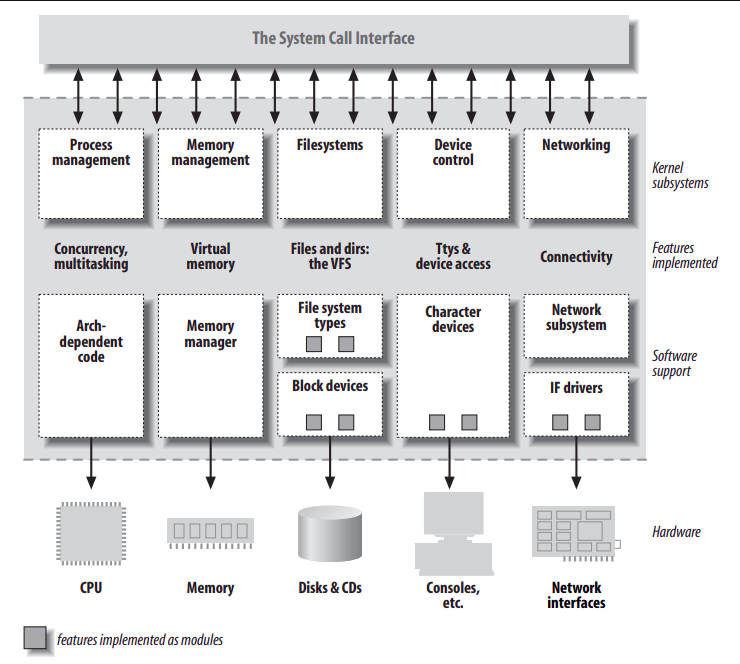

# An Introduction to Device Drivers

## The role of the device drivers

Most programming problems can be split into two parts; "what capabilities are to be provided" (mechnism), "how those capabilities can be used" (policy). If the two issues are addressed by different parts of programs altogether, the software packages are much easier to develop and to adapt to particular needs. For example, Unix management of the graphic display is split between the X server, which knows the hardware and offers a unified interface to user programs, and the window and session managers, which implement a particular policy without knowing anything about the hardware. People can use the same windows manager on different hardware, and different users can run different configurations on the same workstations. Event completely different desktop environments, such as KDE and GNOME, can coexist on the same system. Where drivers are concerned, the same separation of mechanism and policy applies. The floppy driver is policy free, its role is only to show the diskette as a continuous array of data blocks. Higher levels of the system provide policies, such as who may acces the floppy drive, whether the drive is accessed directly or via a filesystem, and whether users may mount filesystems on the drive. Since different environments usually need to use hardware in different ways, it's important to be as policy free as possible.

Drivers are basically nothing but a software layer that lies between the applications and the actual device. Different drivers can offer different capabilities, even for the same device. The actual driver design should be balanced between many different considerations. For instance, a single device may be used concurrently by different programs, and the driver programmer has complete freedom to determine how to handle concurrency. You could implement memory mapping on the device independently of its hardware capabilities, or you could provide a user library to help application programmers implement new policies on top of the available primitives, and so forth.

Policy-free drivers have a number of typical characteristics. These include support for both synchronous and asynchronous operation, the ability to be opened multiple times, the ability to exploit the full capabilities of the hardware, and the lack of the software layers to "simplfy things" or provide policy-related operations. Drivers of this sort not only work better for their end users, but also turn out to be easier to write and maintain as well. Being policy-free is actually a common target for software designers.

Many device drivers, indeed, are released together with user programs to help with configuration and access to the target device. Those programs can range from simple utilities to complete graphical applications. Examples include the _tunelp_ program, which adjusts how the parallel port printer driver operates, and the graphical _cardctl_ utility that is part of the PCMCIA driver package. Often a client library is provided as well, which provides capabilities that don't need to be implemented as part of the driver itself.

## Splitting the Kernel
In a Unix system, several concurrent _**process**_ attend to different tasks. Each process asks for system resources, be it computing power, memory, network connectivity, or some other resource. The ___kernel___ is the big chunk of executable code in charge of handling all such requests. Although the distinction between the different kernel tasks is not always clearly marked, the kernel's role can be split into the following parts:
* _**Process management**_; the kernel is in charge of creating and destroying process and handling their connection to the outside world (input and output). Communication among different processes (through signals, pipes, or interprocess communication primitives) is basic to the overall system funtionality and is also handled by the kernel. In addition, the scheduler, which controls how processes share the CPU, is part of process management. More generally, the kernel's process management activity implements the abstraction of several processes on top of a single CPU or a few of them.
* _**Memory management**_; the computer's memory is a major resource, and the policy used to deal with it is a critical oen for system performance. The kernel builds up a virtual addressing space for any and all processes on top of the limited available resources. The different parts of the kernel interact with the memory-management subsystem through a set of function calls, ranging from the simple _malloc/free_ pait to much more complex functionalities.
* _**Filesystems**_; Unix is heavliy based on the filesystem concept; almost everything in Unix can be treated as a file. The kernel builds a structured filesystem on top of unstructured hardware, and the resulting file abstraction is heavily used throughout the whole system. In addition, Linux supports multiple filesystem types, that is, different ways of organizing data on the physical medium. For example, disk may be formatted with the Linux-standart ext3 filesystem, the commonly used FAT filesystem or several others.
*_**Device control**_; almost every system operation eventually maps to a physical device. With the exception of the processor, memory, and a very few other entities, any and all device control operations are performed by code that is specific to the device being addressed. That code is called **device driver**. The kernel must have embedded in it a device driver for every peripheral present on a system, from the hard drive to the keybord and the tape drive.
*_**Networking**_; must be managed by the operating system, because most network operations are not specific to a process: incoming packets are asynchronous events. The packets must be collected, identified, and dispatched before a process takes care of them. The system is in charge of delivering data packets across program and network interfaces, and it must control the execution of programs according to their network activitiy. Additionally, all the routing and address resolution issues are implemented within the kernel.

## Loadable Modules
One of the great features of Linux is the ability to extend at runtime the set of features offered by the kernel. This means you can add and remove functionality to the kernel while it's up and running.

The code that can be added to the kernel at runtime is called a _**module**_. Linux kernel offers support for quite a few different types of modules, including, but not limited to, device drivers. Each module is made up of object code (not linked into a complete executable) that can be dynamically linked to the running kernel by the _**insmod**_ program and can be unlinked by the _**rmmod**_ program.

## Classes of Devices and Modules
The Linux way of looking at devices distinguishes between three fundamental device types. Each module usually implements one of these types, and is classifiable as a _**char module**_, a _**block module**_, or a _**network module**_. The classification of the modules is not rigid, **so the programmer can choose to build huge modules implementing different drivers in a single chunk of code**. But **good programmers, nonetheless, usually create a different module for each new functionality they implement**, because decomposition is a key element of scalability and extendability.

### These three classes
#### Character devices
A character (char) device is one that can be accessed as a stream of bytes (like a file); a char driver is in charge of implementing this behavior. Such a driver usually implements at leat _**open**_, _**close**_, _**read**_, and _**write**_ system calls. The text console _/dev/console_ and the serial ports _/dev/ttyS0 and friends_ are example of char devices, as they're well represented by the stream abstraction. The only relevant difference between a char device and a regular file is that you can always move back and forth in the regular file, whereas most char devices are just data channels, which you can only access sequentially. There exist, nonetheless, char devices that look like data areas, and you can move back and forth in them; for instance, this usually applies to **frame grabber**, where the applications can access the whole acquired image using _nmap_ or _seek_.
#### Block devices
Like char devices, block devices are accessed by filesystem nodes in the _/dev_ directory. In most Unix systems, a block device can only handle I/O operations that transfer one or more whole blocks, which are usually 512 bytes (or a larger power of two) in length. Linux allows the application to read and write a block device like a char device, it permits the transfer of any number of bytes at a time. As a result, block and char devices differ only in the way is managed internally by the kernel, and thus in the kernel/driver software interface. Like char device, each block device is accessed through a filesystem node, and the difference between them; **each block devices are transparent to the user**. 
#### Network interfaces
Any network transaction is made through an interface, that is, a device that is able to exchange data with other hosts. Usually, an interface is a hardware device, but it might also be a pure software device, like the _**loopback interface**_. A network interface is in charge of sending and receiving data packets, driven by the network subsystem of the kernel. A network driver knows nothing about individual connecitons; it only handles packets. The Unix way to provide access to interfaces is still by assigning a unique name to them - such as _eth0_ - but that name doesn't have a corresponding entry in the filesystem. Communication between the kernel and a network device driver is completely different from that used with char and block drivers. Instead _read_ and _write_, the kernel calls functions related to packet transmission.

## Security Issues
Any security check in the system is enforced by kernel code. If the kernel has security holes, then the system as a whole has holes. In the official kernel distribution, only an authorized user can load modules; the system call *init_modules* checks if the invoking process is authorized to load a module into the kernel. If possible, driver developers should avoid encoding security policy in their code.

As a device driver developer, you should be aware of situations in which some types of device access could adversly affect the system as a whole and should provide adequate controls. For example, device operations that affect global resources (such as setting an interrupt line), **which could damage the hardware** (loading firmware, for instance), or that could affect other users (such as setting a default block size on a tape drive), are usually only available to sufficiently privileged users, and this check must be made in the driver itself.

Driver developers must also be careful, of course, to avoid introducing security bugs. The C programming language makes it easy to make several types of errors. Many current security problems are created, for example, by _buffer overrun_ errors, in which the programmer forgets to check how much data is written to a buffer, and data ends up written beyond the end of the buffer, thus overwriting unrelated data. Such errors can compromise the entire system.

