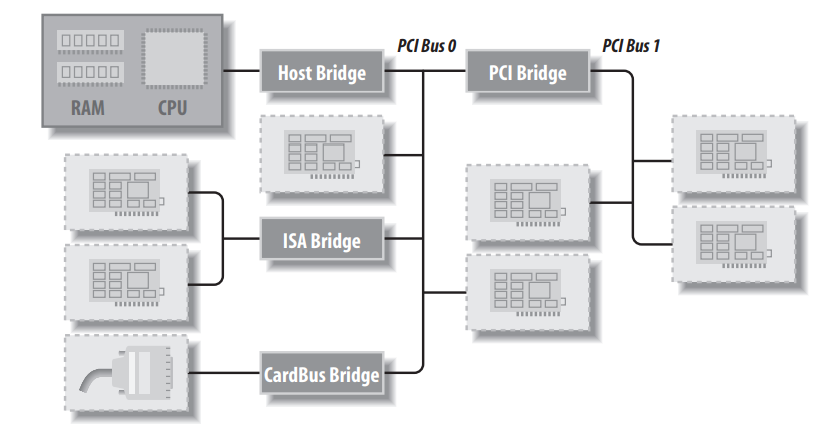
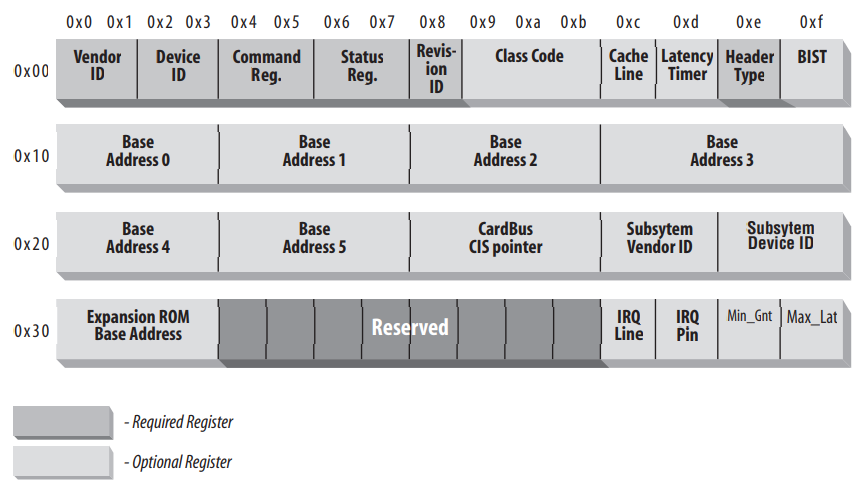

# PCI Drivers

This chapter provides an overview of the higher-level bus architectures. The primary focus is on the kernel functions that access Peripheral Component Interconnect (PCI)

## The PCI Interface

PCI is a complete set of specifications defining how different parts of a computer should interact. We will concern wiht how a PCI driver can find its hardware and gain access to it, in this section. PCI devices are automatically configured at boot time. Then, the device driver must be able to access configuration information in the device in order to complete initialization.

## PCI Addressing

The 16-bit hardware addresses associated with PCI peripherals are still visible occasionally, especially when lists of devices are being used. One such situation is output of _**lspci**_. Each PCI peripheral is identified by a _**bus number**_, a _**device number**_, and a _**function number**_. Device drivers written for Linux use a specific data structure, called *pci_dev*, to act on the devices. PCI domain information is in the _**/proc/pci**_ and _**/proc/bus/pci**_ files.

### Layout of a typical PCI system


For example, _**/proc/bus/pci/devices**_ uses a single 16-bit field (to ease a parsing and sorting), while _**/proc/bus/busnumber**_ splits the address into three fields. How those address appear, showing only the beginning of the output lines:
```
$ lspci | cut -d: -f1-3
0000:00:00.0 Host bridge
0000:00:00.1 RAM memory
0000:00:00.2 RAM memory
0000:00:02.0 USB Controller
0000:00:04.0 Multimedia audio controller
0000:00:06.0 Bridge
0000:00:07.0 ISA bridge
0000:00:09.0 USB Controller
0000:00:09.1 USB Controller
0000:00:09.2 USB Controller
0000:00:0c.0 CardBus bridge
0000:00:0f.0 IDE interface
0000:00:10.0 Ethernet controller
0000:00:12.0 Network controller
0000:00:13.0 FireWire (IEEE 1394)
0000:00:14.0 VGA compatible controller
```
***
```
$ cat /proc/bus/pci/devices | cut -f1
0000
0001
0002
0010
0020
0030
0038
0048
0049
004a
0060
0078
0080
0090
0098
00a0
```
***
```
$ tree /sys/bus/pci/devices/
/sys/bus/pci/devices/
|-- 0000:00:00.0 -> ../../../devices/pci0000:00/0000:00:00.0
|-- 0000:00:00.1 -> ../../../devices/pci0000:00/0000:00:00.1
|-- 0000:00:00.2 -> ../../../devices/pci0000:00/0000:00:00.2
|-- 0000:00:02.0 -> ../../../devices/pci0000:00/0000:00:02.0
|-- 0000:00:04.0 -> ../../../devices/pci0000:00/0000:00:04.0
|-- 0000:00:06.0 -> ../../../devices/pci0000:00/0000:00:06.0
|-- 0000:00:07.0 -> ../../../devices/pci0000:00/0000:00:07.0
|-- 0000:00:09.0 -> ../../../devices/pci0000:00/0000:00:09.0
|-- 0000:00:09.1 -> ../../../devices/pci0000:00/0000:00:09.1
|-- 0000:00:09.2 -> ../../../devices/pci0000:00/0000:00:09.2
|-- 0000:00:0c.0 -> ../../../devices/pci0000:00/0000:00:0c.0
|-- 0000:00:0f.0 -> ../../../devices/pci0000:00/0000:00:0f.0
|-- 0000:00:10.0 -> ../../../devices/pci0000:00/0000:00:10.0
|-- 0000:00:12.0 -> ../../../devices/pci0000:00/0000:00:12.0
|-- 0000:00:13.0 -> ../../../devices/pci0000:00/0000:00:13.0
`-- 0000:00:14.0 -> ../../../devices/pci0000:00/0000:00:14.0
```
All three lsits of devices are sorted in the same order, since _lspci_ uses the _/proc_ files as its source of information. Taking the VGA vido controller as an example, 0x00a0 means 0000:00:14.0 when split into domain (16 bits), bus (8 bits), device (5 bits) and function (3 bits).

## Boot Time

To see how PCI works, we start from system boot, since that's when the devices are configured. The user can look at the PCI device list and the devices' configuration registers by reading _**/proc/bus/pci/devices**_ and ___/proc/bus/pci/ * / *___. The former is a text file with (hexadecimal) device information, and the latter are binary files that report a snapshot of the configuration registers of each device, one file per device. The individual PCI device directories in the sysfs tree can be found in _**/sys/bus/pci/devices**_. A PCI device directory contains a number of different files:

```
$ tree /sys/bus/pci/devices/0000:00:10.0
/sys/bus/pci/devices/0000:00:10.0
|-- class
|-- config
|-- detach_state
|-- device
|-- irq
|-- power
| `-- state
|-- resource
|-- subsystem_device
|-- subsystem_vendor
`-- vendor
```
## Configuration Registers and Initialization

In this section, we will look at the configuration registers that PCI devices contain. All PCI devices feature at least a 256-byte address space. The first 64 bytes are standard, while the rest are **device depenedent**. The following figure shows the layout of the device-independent configuration space:



PCI registers are always little-endian. **The driver writer should be careful about byte ordering when accessing multibyte configuration registers; code that works on the PC might not work on other platforms.** If you ever need to convert data from host order to PCI order or vice versa, you can resort to the functions defined in <asm/byteorder.h>, knowing that PCI byte order is little-endian. What we’re interested in is how a driver can look for its device and how it can access the device’s configuration space.

Three or five PCI registers identify a device: vendorID, deviceID, and class are the three that are always used. Every PCI manufacturer assigns proper values to these read-only registers, and the driver can use them to look for the device. Additionally, the fields subsystem vendorID and subsystem deviceID are sometimes set by the vendor to further differentiate similar devices. Let's look at these registers in more detail:

> **vendorID**
>>This 16-bit register identifies a hardware manufacturer. For instance, every Intel device is marked with the same vendor number, 0x8086. There is a global registry of such numbers, maintained by the PCI Special Interest Group, and manufacturers must apply to have a unique number assigned to them.

> **deviceID**
>>This is another 16-bit register, selected by the manufacturer; no official registration is required for the device ID. This ID is usually paired with the vendor ID to make a unique 32-bit identifier for a hardware device. We use the word signature to refer to the vendor and device ID pair. A device driver usually relies on the signature to identify its device; you can find what value to look for in the hardware manual for the target device.

> **class**
>>Every peripheral device belongs to a class. The class register is a 24-bit value whose top 8 bits identify the “base class” (or group). For example, “ethernet” and “token ring” are two classes belonging to the “network” group, while the “serial” and “parallel” classes belong to the “communication” group. Some drivers can support several similar devices, each of them featuring a different signature but all belonging to the same class; these drivers can rely on the class register to identify their peripherals, as shown later.

> **subsystem vendorID**

> **subsystem deviceID**
>>These fields can be used for further identification of a device. If the chip is a generic interface chip to a local (onboard) bus, it is often used in several completely different roles, and the driver must identify the actual device it is talking with. The subsystem identifiers are used to this end.

Using these different identifiers, a PCI driver can tell the kernel what kind of devices it supports. The struct **pci_device_id** structure is used to define a list of the different types of PCI devices that a driver supports. This structure contains the following fields:

```
__u32 vendor;
__u32 device;
    These specify the PCI vendor and device IDs of a device. If a driver can handle
    any vendor or device ID, the value PCI_ANY_ID should be used for these fields.
__u32 subvendor;
__u32 subdevice;
    These specify the PCI subsystem vendor and subsystem device IDs of a device. If
    a driver can handle any type of subsystem ID, the value PCI_ANY_ID should be
    used for these fields.
__u32 class;
__u32 class_mask;
    These two values allow the driver to specify that it supports a type of PCI class
    device. The different classes of PCI devices (a VGA controller is one example)
    are described in the PCI specification. If a driver can handle any type of class, the
    value 0 should be used for these fields.
kernel_ulong_t driver_data;
    This value is not used to match a device but is used to hold information that the
    PCI driver can use to differentiate between different devices if it wants to.
    
There are two helper macros that should be used to initialize a struct pci_device_id
structure:
 
PCI_DEVICE(vendor, device)
    This creates a struct pci_device_id that matches only the specific vendor and
    device ID. The macro sets the subvendor and subdevice fields of the structure to
    PCI_ANY_ID.
PCI_DEVICE_CLASS(device_class, device_class_mask)
    This creates a struct pci_device_id that matches a specific PCI class.
```
An example of using these macros to define the type of devices a driver supports can be found in the following kernel files:
```
drivers/usb/host/ehci-hcd.c:

static const struct pci_device_id pci_ids[ ] = { {
     /* handle any USB 2.0 EHCI controller */
    PCI_DEVICE_CLASS(((PCI_CLASS_SERIAL_USB << 8) | 0x20), ~0),
    .driver_data = (unsigned long) &ehci_driver,
    },
    { /* end: all zeroes */ }
};

drivers/i2c/busses/i2c-i810.c:

static struct pci_device_id i810_ids[ ] = {
    { PCI_DEVICE(PCI_VENDOR_ID_INTEL, PCI_DEVICE_ID_INTEL_82810_IG1) },
    { PCI_DEVICE(PCI_VENDOR_ID_INTEL, PCI_DEVICE_ID_INTEL_82810_IG3) },
    { PCI_DEVICE(PCI_VENDOR_ID_INTEL, PCI_DEVICE_ID_INTEL_82810E_IG) },
    { PCI_DEVICE(PCI_VENDOR_ID_INTEL, PCI_DEVICE_ID_INTEL_82815_CGC) },
    { PCI_DEVICE(PCI_VENDOR_ID_INTEL, PCI_DEVICE_ID_INTEL_82845G_IG) },
    { 0, },
};
```
These examples create a list of struct pci_device_id structures, with an empty structure set to all zeros as the last value in the list. This array of IDs is used in the struct pci_driver (described below), and it is also used to tell user space which devices this specific driver supports.

## MODULE_DEVICE_TABLE

This pci_device_id structure needs to be exported to user space to allow the hotplug and module loading systems know what module works with what hardware devices. The macro MODULE_DEVICE_TABLE accomplishes this>
```
MODULE_DEVICE_TABLE(pci, i810_ids);
```
This statement creates a local variable called __mod_pci_device_table that points to the list of struct pci_device_id. Later in the kernel build process, the depmod program searches all modules for the symbol __mod_pci_device_table. If that symbol is found, it pulls the data out of the module and adds it to the file **/lib/modules/[kernel_version]/modules.pcimap**. After depmod completes, all PCI devices that are supported by modules in the kernel are listed, along with their module names, in that file. When the kernel tells the hotplug system that a new PCI device has been found, the hotplug system uses the **modules.pcimap** file to find the proper driver to load.

## Registering a PCI Driver

The main structure that all PCI drivers must create in order to be registered with the kernel properly is the struct pci_driver structure. This structure consists of a number of function callbacks and variables that describe the PCI driver to the PCI core. Here are the fields in this structure that a PCI driver needs to be aware of:
```
const char *name;
    The name of the driver. It must be unique among all PCI drivers in the kernel
    and is normally set to the same name as the module name of the driver. It shows up 
    in sysfs under /sys/bus/pci/drivers/ when the driver is in the kernel.
const struct pci_device_id *id_table;
    Pointer to the struct pci_device_id table desribed earlier in this chapter
int (*probe) (struct pci_dev *dev, const struct pci_device_id *id);
    Pointer to the probe functon in the PCI driver. This function is called by
    the PCI core when it has a struct pci_dev that it thinks this driver wants
    to control. A pointer to the struct pci_device_id that the PCI core used to
    make this decision is also passed to this function. If the PCI driver claims
    the struct pci_dev that is passed to it, it should initialize the device properly
    and return 0. If the driver does not want to claim the device, or an error 
    occurs, it should return a negative error value. More details about this 
    function follow later in this chapter.
void (*remove) (struct pci_dev *dev);
    Pointer to the function that the PCI core calls when the struct pci_dev is being
    removed from the system, or when the PCI driver is being unloaded from the
    kernel. More details about this function follow later in this chapter.
int (*suspend) (struct pci_dev *dev, u32 state);
    Pointer to the function that the PCI core calls when the struct pci_dev is being
    suspended. The suspend state is passed in the state variable. This function is
    optional; a driver does not have to provide it.
int (*resume) (struct pci_dev *dev);
    Pointer to the function that the PCI core calls when the struct pci_dev is being
    resumed. It is always called after suspend has been called. This function is
    optional; a driver does not have to provide it.
```
In summary, to create a proper struct pci_driver structure, only four fields need to be initialized:
```
static struct pci_driver pci_driver = {
    .name = "pci_skel",
    .id_table = ids,
    .probe = probe,
    .remove = remove,
};
```
To register the struct pci_driver with the PCI core, a call to *pci_register_driver* is made with a pointer to the struct pci_driver. This is traditionally done in the module initialization code for the PCI driver:
```
static int __init pci_skel_init(void)
{
    return pci_register_driver(&pci_driver);
}
```
_**pci_register_driver**_ returns a negative in an error case, and 0 if everything was registered successfully.

When the PCI driver is to be unloaded, the struct pci_driver needs to be unregistered from the kernel. This is done with a call to pci_unregister_driver. When this call
happens, any PCI devices that were currently bound to this driver are removed, and
the remove function for this PCI driver is called before the pci_unregister_driver function returns.
```
static void __exit pci_skel_exit(void)
{
    pci_unregister_driver(&pci_driver);
}
```
## Enabling the PCI Device

In the _probe_ function for the PCI driver, before the driver can access any device resource (I/O region or interrupt) of the PCI device, the driver must call the _**pci_enable_device**_ function:
```
int pci_enable_device(struct pci_dev *dev);
    This function actually enables the device. It wakes up the device and in some
    cases also assigns its interrupt line and I/O regions. This happens, for example,
    with CardBus devices (which have been made completely equivalent to PCI at the driver level).
```

## Accessing the Configuration Space

After the driver has detected the device, it usually needs to read from or write to the
three address spaces: **memory, port**, and **configuration.** In particular, accessing the
configuration space is vital to the driver, because it is the only way it can find out
where the device is mapped in memory and in the I/O space. Because the microprocessor has no way to access the configuration space directly,
the computer vendor has to provide a way to do it. To access configuration space,
the CPU must write and read registers in the PCI controller, but the exact implementation is vendor dependent and not relevant to this discussion, because Linux offers a standard interface to access the configuration space.

As far as the driver is concerned, the configuration space can be accessed through 8-bit, 16-bit, or 32-bit data transfers. The relevant functions are prototyped in _<linux/pci.h>_:
```
int pci_read_config_byte(struct pci_dev *dev, int where, u8 *val);
int pci_read_config_word(struct pci_dev *dev, int where, u16 *val);
int pci_read_config_dword(struct pci_dev *dev, int where, u32 *val);
    Read one, two, or four bytes from the configuration space of the device identified
    by dev. The where argument is the byte offset from the beginning of the configuration 
    space. The value fetched from the configuration space is returned through the
    val pointer, and the return value of the functions is an error code. The word
    and dword functions convert the value just read from little-endian to the native
    byte order of the processor, so you need not deal with byte ordering.
    
int pci_write_config_byte(struct pci_dev *dev, int where, u8 val);
int pci_write_config_word(struct pci_dev *dev, int where, u16 val);
int pci_write_config_dword(struct pci_dev *dev, int where, u32 val);
    Write one, two, or four bytes to the configuration space. The device is identified
    by dev as usual, and the value being written is passed as val. The word and
    dword functions convert the value to little-endian before writing to the peripheral device.
```
All of the previous functions are implemented as inline functions that really call the
following functions. Feel free to use these functions instead of the above in case the
driver does not have access to a struct pci_dev at any particular moment in time:
```
int pci_bus_read_config_byte (struct pci_bus *bus, unsigned int devfn, int where, u8 *val);
int pci_bus_read_config_word (struct pci_bus *bus, unsigned int devfn, int where, u16 *val);
int pci_bus_read_config_dword (struct pci_bus *bus, unsigned int devfn, int where, u32 *val);
    Just like the pci_read_ functions, but struct pci_bus * and devfn variables are
    needed instead of a struct pci_dev *.

int pci_bus_write_config_byte (struct pci_bus *bus, unsigned int devfn, int where, u8 val);
int pci_bus_write_config_word (struct pci_bus *bus, unsigned int devfn, int where, u16 val);
int pci_bus_write_config_dword (struct pci_bus *bus, unsigned int devfn, int where, u32 val);
    Just like the pci_write_ functions, but struct pci_bus * and devfn variables are
    needed instead of a struct pci_dev *.
```
The best way to address the configuration variables using the pci_read_ functions is by means of the symbolic names defined in **<linux/pci.h>**. For example, the following small function retrieves the revision ID of a device by passing the symbolic name for where to *pci_read_config_byte*:

```
static unsigned char skel_get_revision(struct pci_dev *dev)
{
    u8 revision;
    pci_read_config_byte(dev, PCI_REVISION_ID, &revision);
    return revision;
}
```

## Accessing the I/O and Memory Spaces

A PCI device impements up to **six** I/O address regions. Each region consists of either **memory** or **I/O** locations. Most devices implement their I/O registers in memory regions, it's generally a saner approach. However, unlike normal memory, I/O registers should not be cached by the CPU because each access can have side effects. The PCI device that implements I/O registers as a memory region marks the difference by setting a "memory-is-prefetchable" bit in its configuration register (_**The information lives in one of the low-order bits of the base address PCI register. The bits are defined in <linux/pci.h>**_). If the memory region is marked as prefetchable, the CPU can cache its contents and do all sorts of optimization with it; nonprefetchable memory access, on the other hand, can’t be optimized because each access can have side effects, just as with I/O ports. We use the word _region_ to refer to a generic I/O address space that is memory-mapped or port-mapped.

An interface board reports the size and current location of its regions using configuration registers, the six 32-bit registers shown in the figure of the standardized PCI configuration registers above, whose symbolic names are PCI_BASE_ADDRESS_0 through PCI_BASE_ADDRESS_5. Since the I/O space defined by PCI is a 32-bit address space, it makes sense to use the same to use the same configuration interface for memory and I/O. If the device uses a 64-bit address bus, it can declare regions in the 64-bit memory space by using two consecutive PCI_BASE_ADDRESS registers for each region, low bits first. It is possible for one device to offer both 32-bit regions and 64-bit regions.

In the kernel, the I/O regions of PCI devices have been integrated into the generic resource management. For this reason, you don't need to access the configuration variables in order to know where your device is mapped in memory or I/O space. The preferred interface for getting region information consists of the following functions:

```
unsigned long pci_resource_start(struct pci_dev *dev, int bar);
    The function returns the first address (memory address or I/O port number)
    associated with one of the six PCI I/O regions. The region is selected by the
    integer bar (the base address register), ranging from 0–5 (inclusive).
    
unsigned long pci_resource_end(struct pci_dev *dev, int bar);
    The function returns the last address that is part of the I/O region number bar.
    Note that this is the last usable address, not the first address after the region.
    
unsigned long pci_resource_flags(struct pci_dev *dev, int bar);
    This function returns the flags associated with this resource.
```

Resource flags are used to define some features of the individual resource. For PCI resources associated with PCI I/O regions, the information is extracted from the base address registers, but can come from elsewhere for resources not associated with PCI devices.

All resource flags are defined in _**<linux/ioport.h>**_; the most important are:
```
IORESOURCE_IO
IORESOURCE_MEM
    If the associated I/O region exists, one and only one of these flags is set.
    
IORESOURCE_PREFETCH
IORESOURCE_READONLY
    These flags tell whether a memory region is prefetchable and/or write protected.
    The latter flag is never set for PCI resources.
```
By making use of the *pci_resource_* functions, a device driver can completely ignore the underlying PCI registers, since the system already used them to structure resource information.

## PCI Interrupts

As far as interrupts are concerned, PCI is easy to handle. By the time Linux boots, the computer's firmware has already assigned a unique interrupt number to the device, and the driver just needs to use it. The interrupt number is stored in confguration register 60 (PCI_INTERRUPT_LINE), which is one byte wirde. This allows for as many as 256 interrupt lines, but the actual limit depends on the CPU being used. The driver doesn't need to bother checking the interrupt number, because the value found in PCI_INTERRUPT_LINE is guaranteed to be the right one.

If the device doesn't support interrupts, register 61 (PCI_INTERRUPT_PIN) is 0; otherwise, nonzero. However, since the driver knows if its device is interrupt driven or not, it doesn't usually need to read PCI_INTERRUPT_PIN.

Thus, PCI-specific code for dealing with interrupts just needs to read the configuration byte to obtain the interrupt number that is saved in a local variable, as shown in the following code:
```
result = pci_read_config_byte(dev, PCI_INTERRUPT_LINE, &myirq);
if (result) {
    /* deal with error */
}
```

## Quick Reference

```
#include <linux/pci.h>
    Header that includes symbolic names for the PCI registers and several vendor
    and device ID values.

struct pci_dev;
    Structure that represents a PCI device within the kernel.

struct pci_driver;
    Structure that represents a PCI driver. All PCI drivers must define this.

struct pci_device_id;
    Structure that describes the types of PCI devices this driver supports.

int pci_register_driver(struct pci_driver *drv);
int pci_module_init(struct pci_driver *drv);
void pci_unregister_driver(struct pci_driver *drv);
    Functions that register or unregister a PCI driver from the kernel.

struct pci_dev *pci_find_device(unsigned int vendor, unsigned int device, struct pci_dev *from);
struct pci_dev *pci_find_device_reverse(unsigned int vendor, unsigned int device, const struct pci_dev *from);
struct pci_dev *pci_find_subsys (unsigned int vendor, unsigned int device, unsigned int ss_vendor, unsigned int ss_device, const struct pci_dev *from);
struct pci_dev *pci_find_class(unsigned int class, struct pci_dev *from);
    Functions that search the device list for devices with a specific signature or those
    belonging to a specific class. The return value is NULL if none is found. from is
    used to continue a search; it must be NULL the first time you call either function,
    and it must point to the device just found if you are searching for more devices.
    These functions are not recommended to be used, use the pci_get_ variants
    instead.
    
struct pci_dev *pci_get_device(unsigned int vendor, unsigned int device, struct pci_dev *from);
struct pci_dev *pci_get_subsys(unsigned int vendor, unsigned int device, unsigned int ss_vendor, unsigned int ss_device, struct pci_dev *from);
struct pci_dev *pci_get_slot(struct pci_bus *bus, unsigned int devfn);
    Functions that search the device list for devices with a specific signature or
    belonging to a specific class. The return value is NULL if none is found. from is
    used to continue a search; it must be NULL the first time you call either function,
    and it must point to the device just found if you are searching for more devices.
    The structure returned has its reference count incremented, and after the caller is
    finished with it, the function pci_dev_put must be called.

int pci_read_config_byte(struct pci_dev *dev, int where, u8 val);
int pci_read_config_word(struct pci_dev *dev, int where, u16 val);
int pci_read_config_dword(struct pci_dev *dev, int where, u32 val);
int pci_write_config_byte (struct pci_dev *dev, int where, u8 *val);
int pci_write_config_word (struct pci_dev *dev, int where, u16 *val);
int pci_write_config_dword (struct pci_dev *dev, int where, u32 *val);
    Functions that read or write a PCI configuration register. Although the Linux
    kernel takes care of byte ordering, the programmer must be careful about byte
    ordering when assembling multibyte values from individual bytes. The PCI bus
    is little-endian.

int pci_enable_device(struct pci_dev *dev);
    Enables a PCI device.

unsigned long pci_resource_start(struct pci_dev *dev, int bar);
unsigned long pci_resource_end(struct pci_dev *dev, int bar);
unsigned long pci_resource_flags(struct pci_dev *dev, int bar);
    Functions that handle PCI device resources.
```

