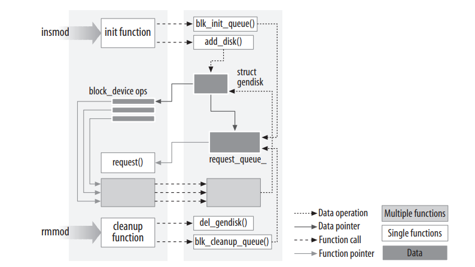
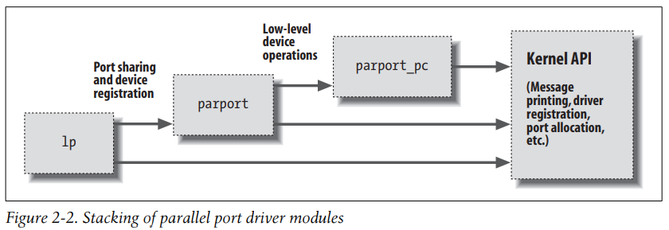

# Building and Running Modules

This chapter talks only about modules, without referring to any specific device class.

## Setting up your test system

Building, loading and modifying some example modules will be presented in this chapter. It's good way to improve your understanding of how drivers work and interact with the kernel. It's recommended to work with a "mainline" kernel directly from the kernel.org mirror network. Vendor kernels can be heavily patched and divergent from the mainline; at times, vendor patches can change the kernel API.

## The Hello World module

Almost everything about programming starts with "hello world" which is the easiest way of showing how the things work. The following code is a complete "hello world" module;

```
#include <linux/init.h>
#include <linux/module.h>
MODULE_LICENSE("Dual BSD/GPL");

static int hello_init(void) {
    printk(KERN_ALERT "Hello, world\n");
    return 0;
}

static void hello_exit(void) {
    printk(KERN_ALERT "Goodbye, cruel world\n");
}

module_init(hello_init);
module_exit(hello_exit);
```
This module defines simply two functions, one to be invoked when the module is loaded into the kernel (*hello_init*) and one for when the module is removed (*hello_exit*). *module_init* and *module_exit* lines use special kernel macros to indicate the role of these two functions. The *printk* function is defined in the Linux kernel, it behaves similarly to the standard C library funtion *printf*. The module can call *printk* because, after *insmod* has loaded it, the module is linked to the kernel and can access the kernel's **public** symbols (functions and variables). The string KERN_ALERT is the priority of the message.

You can test the module with the *insmod* and *rmmod* utilities, as shown below.

```
% make
make[1]: Entering directory `/usr/src/linux-...'
 CC [M] /home/ldd3/src/misc-modules/hello.o
 Building modules, stage 2.
 MODPOST
 CC /home/ldd3/src/misc-modules/hello.mod.o
 LD [M] /home/ldd3/src/misc-modules/hello.ko
make[1]: Leaving directory `/usr/src/linux-2.6.10'
% su
root# insmod ./hello.ko
Hello, world
root# rmmod hello
Goodbye, cruel world
root#
```

If you're running *insmod* and *rmmod* from a terminal emulator running under the window system, you won't see anything on your the screen. The messages goes to one of the system log files, such as *var/log/messages*.

## Kernel Modules vs. Applications

While most small and medium-sozed applications perform a single task from beginning to end, every kernel module just registers itself in order to serve future requests, and its initialization function terminates immediately. In other words, the task of the module's initialization function is to prepare for later invocation of the module's functions. This kind of approach to programming is similar to **event-driven programming**, but while not all aplications are event-driven, each and every kernel module is. Incidently, the ability to unload a module is one of the features of modularization that is appreciated most. An application can call functions it doesn't define: the linking stage resolves external references using the approproate library of functions. A module, on the other hand, is linked only to the kernel, and the only funtions it can call are the ones exported by the kernel; there are no libraries to link to.

The following figure shows how function calls and function pointers are used in a module to add new functionality.



Because no library is linked to modules, source files should never include the usual header files, <stdarg.h> and very special situations being the only exceptions. It means, only functions that are actually part of the kernel itself may be used in kernel modules. Anything related to the kernel is declared in headers found in the ekrnel source tree; most of relevant headers live in *include/linux* and *include/asm*. 

Another important difference between kernel programming and application programming is; whereas a segmentation fault is mostly harmless during application development and a debugger can always be used to trace the error to the problem in the source code, a kernel fault kills the current process at least, if not the whole system. 

## User Space and Kernel Space

A module runs in *kernel space*, whereas applications run in *user space*. This concept is at the base of operating systems theory. The role of operating system, in practice, is to provide programs with a consistent view of the computer's hardware.  In addition, the operating system must
account for independent operation of programs and protection against unauthorized access to resources. This nontrivial task is possible only if the CPU enforces protection of system software from the applications. All current processors have at least two protection levels, but x86 have more. The levels have different roles, some operations are disallowed at the lower levels; program code can switch from one level to another only through a limited number of gates. Unix systems use the advantage of this hardware feature. Under Unix, the kernel executes in the highest level (also called *supervisor mode*), where everything is allowed, whereas applications execute in the lowest level (*user mode*), where the processor regulates direct access to hardware and unauthorized access to memory. Execution modes are usually referred as *kernel space* and *user space*. The role of a module is to extend kernel functionality; modularized code runs in kernel space. Usually a driver performs both the tasks outlined previously: some functions in the module are executed as part of system calls, and some are in charge of interrupt handling.

## Concurrency in the Kernel

Most applications (except multithreading applications) typically run sequentially. Kernel code does not run in such a simple world, and even the simplest kernel modules must be written with the idea that many things can be happening at once. Naturally, Linux systems run multiple process, more than one of which can be trying to use your driver at the same time. Most devices are capable of interrupting the processor; interrupt handlers run asynchronously and can be invoked at the same time that your driver is trying to do something else. Fortunately, Linux can run on symmetric multiprocessor (SMP) systems, which the result that your driver could be executing concurrently on more than one CPU.

## The Current Process

The following statement pronts the process ID and the command name ofthe current process by accessing certain fields in struct task_struct:
```
printk(KERN_INFO "The process is \"%s\" (pid %i)\n", current->comm, current->pid);
```

The command name stored in current->comm is the base name of the program file (trimmed to 15 characters if need be) that is being executed by the current process.

## A Few Other Details

Applications are laid out in virtual memory with a very large stack area. The stack, of course, is used to hold the function call history and all automatic variables created by currently active functions. The kernel, instead, has a very small stack; it can be as small as a single, 4096-byte page. Your functions must share that stack with the entire kernel-space call chain. Thus, it is never a good idea to declare large automatic variables; if you need larger structures, you should allocate them dynamically at call time.

Often, as you look at the kernel API, you will encounter function names starting with a double underscore (__). Functions so marked are generally a low-level component of the interface and should be used with caution. Essentially, the double underscore says to the programmer: “If you call this function, be sure you know what you are doing.”

Kernel code cannot do floating point arithmetic. **Enabling floating point would require that the kernel save and restore the floating point processor’s state on each entry to, and exit from**, kernel space—at least, on some architectures. Given that there really is no need for floating point in kernel code, the extra overhead is not worthwhile.

## Compiling Modules

As the first step, we need to look a bit at how modules must be built. The build process for modules differs significantly from that used for user-space applications. The build process for modules differs significantly from that used for user-space applications.

Once you have everything set up, creating a **makefile** for your module is straightforward. For instance, for a hello world, a sinlge line shall suffice:
```
obj-m := hello.o
module-objs := file1.o file2.o
```
*module.ko* is generated from two source files (let's say file1.c, file2.c). **Kernel source tree** is a directory which contains all of the kernel source. You can build a new kernel, install that, and reboot your machine to use the rebuilt kernel [Linux kernel tree](https://unix.stackexchange.com/questions/267835/what-is-a-kernel-source-tree#:~:text=The%20source-tree%20is%20a%20directory%20which%20contains%20all,drivers%20which%20are%20normally%20not%20bundled%20with%20Linux.).

Simply, in this chapter, creating a new kernel with the module is shown. Let *~/kernel-2.6* be the directory that the kernel sit.
```
make -C ~/kernel-2.6 M=`pwd` modules
```
This command starts by changing its directory to the one provided with the -C option. The M= option causes that makefile to move back into your module source directory before trying to build the modules target. This target, in turn, refers to the list of modules found in the obj-m variable, which we've set to *module.o* in our examples.

## Loading and Unloading Modules

In the kernel source code, you will find that the names of the system calls are prefixed woth **sys_**. This is vaild for all system calls and no other functions. The *modprobe* utility is like *insmod*. It differs in that it will look at the module to be loaded to see whether it references any symbols that are not currently defined in the kernel. If any such references are found, *modprobe* looks for other modules in the current module search path that define the relevant symbols. When *modprobe* finds those modules (which are needed by the module being loaded), it loads them into the kernel as well. If *insmod* is used in this situation instead, the command fails with an "unresolved symbols" message left in the system logfile. The *lsmod* program produces a list of the modules currently loaded in the kernel. Some other information, such as any other modules making use of a specific module, is also provided. *lsmod* works by reading the */proc/modules* virtual file. Information on currently loaded modules can also be found in the sysfs virtual filesystem under */sys/module*.

## Version Dependency

The module's code has to be recompiled for each version of the kernel that it's linked to, at least, in the absence of modversions. The kernel doesn't just assume that a given module has been built against the proper kernel version. One of the steps in the build process is to link your module against a file (called *vermagic.o*) from the current kernel tree; this object contains a fair amount of information about the kernel the module was built for, including the tarfet kernel version, compiler version, and the settings of a number of important configuration variables. When an attempt is made to load a module, this information can be tested for compatibility with the running kernel. If things don't match, the module is not loaded; instead, you see something like:
```
#insmod hello.ko
Error inserting './hello.ko': -1 Invalid module format
```
A look in the system log file (*/var/log/messages* or whatever your system is configured to use) will reveal the specific problem that caused the module to fail to load. 

Kernel interfaces often change between releases. If you're writing a module that is intended to work with multiple versions of the kernel (especially if it must work across major releases), you likely have to make use of macros and *#ifdef* contructs to make your code build properly. The definitions about this is found in *linux/version.h*. This header file defines the following macros:
#### UTS_RELEASE
This macro expands to a string describing the version of this kernel tree, such as "2.6.10".
#### LINUX_VERSION_CODE
This macro expands to the binary representation of the kernel verison, one byte for each part of the version release number. For example, the code for 2.6.10 is 132618 (i.e., 0x02060a). With this information, you can (almost) easily determine what version of the kernel you are dealing with.
#### KERNEL_VERSION (major,minor,release)
This is the macro used to build an integer version code from the individual numbers that build up a version number. For example, KERNEL_VERSION (2,6,10) expands to 132618. This macro is very useful when you need to compare the current version and a known checkpoint. For dealing with incompatibilities,it's not a good way to clutter driver code with *#ifdef* conditions. Instead, it's best way to collect them in a specific header file.

## Platform Dependency
Unlike application developers, who must link their code with precompiled libraries and stick to conventions on parameter passing, kernel developers can dedicate some processor registers to specific roles. Moreover, kernel code can be optimized for a specific processor in a CPU family to get the best from the target platform: unlike applications that are often distributed in binary format, a custom compilation of the kernel can be optimized for a specific computer set. Clearly, if a module is to work with a given kernel, it must be built with the same understanding of the target processor as that kernel was. Once again, the *vermagic.o* object comes in to play. When a module is loaded, the kernel checks the processor-specific configuration options for the module and makes sure they match the running kernel. If the module was compiled with different options, it's not loaded.

If you're planning to write a driver for general distribution, you may well be wondering just how you can possibily support all these different variations. The best answer, of course, is to release your driver under a GPL-compatible license and contribute it to the mainline kernel. Failing that, distributing your driver in source form and a set of scripts to compile it on the user's system may be the best answer. If you must distribute your driver in binary form, you need to look at the different kernels provided by your target distributions, and provide a version of the module for each.

## The Kernel Symbol Table

We've seen how *insmod* resolves undefined symbols against the table of public kernel symbols. The table contains the addresses of global kernel items (functions and variables) that are needed to implement modularized drivers. When a module is loaded, any symbol exported by the module becomes part of the kernel symbol table. In the usual case, a module implements its own functionality without the need to export any symbols at all. You need to export symbols, however, whenever other modules may benefit from using them.

**New modules** can use symbols exported by your module, and you can stack new modules on top of other modules. Module stacking is implemented in the main stream kernel sources as well: the *msdos* filesystem relies on symbols exported by the *fat* module, and each input USB device module stacks on the *usbcore* and *input* modules.



**When using stacked modules, it's helpful to be aware of the *modprobe* utility.** *modprobe* functions in much the same way as *insmod*, **but it also loads any other modules that are required by the module you want to load.** Although you'll still need *insmod* when loading your own modules from the current directory, because *modprobe* looks only in the standard installed module directories. By the way, using stacking to split modules into multiple layers can help reduce development time by simplifying each layer.

The Linux kernel header files provide a convenient way to manage the visibility of your symbols, thus reducing namespace pollution (filling the namespace with names that may conflict with those defined elsewhere in the kernel) and promoting proper information hiding. If your module needs to export symbols for other modules to use, the following macros should be used:
```
EXPORT_SYMBOL(name);
EXPORT_SYMBOL_GPL(name);
```
Either of the above macros makes the given symbol available outside the module. The _GPL version makes the symbol available to GPL-licensed modules only. 

## Preliminaries
Before we turn a hand to write module, we need to look at some other things that need to appear in the module source files. The kernel is a unique environment, and it imposes its own requirements on code that would interface with it. Most kernel code ends up including a fairly large number of header files to get definitions of functions, data types, and variables. We'll examine these files. There're some specific that must appear in every loadable modules:
```
#include <linux/module.h>
#include <linux/init.h>
```
*init.h* is to specify the initialization and cleanup functions, and *module.h* contains a great many definitions of symbols and functions needed by loadable modules. Most module also include _**moduleparam.h**_ to enable the passing of parameters to the module at load time; we'll get to that shortly.
It's not must, but your module should specify which license applies to its code:
```
MODULE_LICENSE("GPL")
```
Other descriptive definitions that can be contained within a module include MODULE_AUTHOR (stating who wrote the module), MODULE_DESCRIPTION (a humar-readable statement of what the module does), MODULE_VERSION (for a code revision number), MODULE_ALIAS (another name by which this module can be known), MODULE_DEVICE_TABLE (to tell user space about which devices the module supports).

## Initialization and Shutdown

As already mentioned, the module initialization function registers any facility offered by the module. The actual definition of the initialization function always looks like:
```
static int__init initialization_function(void)
{
    /*Initialization code*/
}
module_init(initialization_function);
```
Initialization function should be declared static, since they are not meant to be visible outside the specific file; there's no hard rule about this, though, as no function is exported to the rest of the kernel unless explixitly requested. The __init token is a hint to the kernel that the given function is used only at initialization time. The module loader drops the initialization function after the module is loaded, making its memory available for other uses. There is a similar tag (__initdata) for data used only during initialization. Use of __init and __initdata is optional. Just be sure not to use them for any function (or data structure) you'll be using after initialization completes. __devinit and __devinitdata may be encountered in the kernel source.

The use of *module_init* is mandatory. This macro adds a special section to the module's object code stating where the module's initialization function is to be found. Without this, the initialization function is never called.

Modules can register many different types of facilities, including different kinds of devices, filesystems, cryptographic transforms, and more. for each facility, there's a specific kernel function that accomplishes this registration. They include, among others, serial ports, miscellaneous devices, sysfs entries, */proc* files, executable domains, and line disciplines. Many of those registrable items support functions that aren't directly related to hardware but remain in the "software abstractions" field. Those items can be registered, because they are integrated into the driver's functionality anyway (like */proc* files and line disciplines for example). Most registration functions are prefixed with register_.

## The Cleanup Function

Every nontrivial module also requires a clenup function, which unregisters interfaces and return all resources to the system before the module is removed:
```
static void __exit cleanup_function(void)
{
    /*Cleanup code*/
}

module_exit(cleanup_function);
```
The cleanup function, because it has no value to return, is declared void. The __exit modifier marks the code as being for module unload only. If your module is built directly into the kernel, or if your kernel is configured to disallow the unloading of modules, function marked __exit can be called *only* at module unload or system shutdown time; any other use is an error. If your module doesn't define a cleanup function, **the kernel does not allow it to be unloaded**.

## Error Handling During Initialization

One thing you must always bear in mind when registering facilities with the kernel is that **the registration could fail**. Even the simplest action often requires memory allocation, and the required memory may not be available. So module code must always check return values (this is also valid for application development), and be sure that the requested operations have actually succeeded. If any errors occur when you register utilities , the first order of business is to decide whether the module can continue initializing itself anyway. Often, the module can continue to operate after a registration failure, with degraded functionality if necessary. Whenever possible, your module should press forward and provide what capabilities it can after things fail. If it turns out that your module simply cannot load after a particular type of failure, you must undo any registration activities performed before the failure. If you ever fail to unregister what you obtained, the kernel is left in an unstable state; it contains internal pointers to code that no longer exists. In such situations, the only recourse, usually, is to reboot the system. You really do want to take care to do the right thing when an initialization error occurs. Error recovery is sometimes best handled with the **goto** statement. Using goto is normally hated, but this is a situation where it's useful.

The following sample code (using fictitious registration and unregistration functions) behaves correctly if initialization fails at any point:
```
int __init my_init_function(void)
{
    int err;
    
    /*registration takes a pointer and a name*/
    err = register_this(ptr1, "skull");
    if (err) goto fail_this;
    err = register_that(ptr2, "skull");
    if (err) goto fail_that;
    err = register_those(ptr3, "skull");
    if (err) goto fail_those;
    
    return 0; /* success */
    
    fail_those: unregister_that(ptr2, "skull");
    fail_that: unregister_this(ptr1, "skull");
    fail_this: return err;  /* propagate the error */
}
```

Another option, requiring no hairy goto statements, is keeping track of what has been successfully registered and calling your module’s cleanup function in case of any error. The cleanup function unrolls only the steps that have been successfully accomplished. This alternative, however, requires more code and more CPU time, so in fast paths you still resort to goto as the best error-recovery tool. The return value of my_init_function, err, is an error code. In the Linux kernel, error codes are negative numbers belonging to the set defined in <linux/errno.h>. If you want to generate your own error codes instead of returning what you get from other functions, you should include <linux/errno.h> in order to use symbolic values such as -ENODEV, -ENOMEM, and so on. It is always good practice to return appropriate error codes, because user programs can turn them to meaningful strings using *perror* or similar means. 

Obviously, the module cleanup function must undo any registration performed by the initialization function, and it is customary (but not usually mandatory) to unregister facilities in the reverse order used to register them:
```
void __exit my_cleanup_function(void)
{
    unregister_those(ptr3, "skull");
    unregister_that(ptr2, "skull");
    unregister_this(ptr1, "skull");
    return;
}
```
If your initialization and cleanup are more complex than dealing with a few items, the goto approach may become difficult to manage, because all the cleanup code must be repeated within the initialization function, with several labels intermixed. Sometimes, therefore, a different layout of the code proves more successful.

The cleanup function then must check the status of each item before undoing its registration. In its simplest form, the code looks like the following:
```
struct something *item1;
struct somethingelse *item2;
int stuff_ok;

void my_cleanup(void)
{
    if (item1)
        release_thing(item1);
    if (item2)
        release_thing2(item2);
    if (stuff_ok)
        unregister_stuff();
    return;
}

int __init my_init(void)
{
    int err = -ENOMEM;
    
    item1 = allocate_thing(arguments);
    item2 = allocate_thing2(arguments2);
    if (!item1 || !item2)
        goto fail;
    err = register_stuff(item1, item2);
    if (!err)
        stuff_ok = 1;
    else
        goto fail;
    return 0; /* success */
    
    fail:
        my_clenup();
        return err;
}
```
If you are not careful in how you write your initialization function, you can create situations that can compromise the stability of the system as a whole. You must also consider what happens if your initialization function decides to fail, but some part of the kernel is already making use of a facility your module has registered. If this situation is possible for your module, you should seriously consider not failing the initialization at all. After all, the module has clearly succeeded in exporting something useful. If initialization must fail, it must carefully step around any possible operations going on elsewhere in the kernel until those operations have completed.

## Module Parameters

Several parameters that a driver needs to know can change from sytem to system. These can vary from the device number to use to numerous aspects of how the driver should operate. For example, drivers for SCSI adapters often have options controlling the use of tagged command queuing, and the Integrated Device Electronics (IDE) drivers allow user control of DMA operations. If your driver controls older hardware, it may also need to be told explicitly where to find that hardware’s I/O ports or I/O memory addresses. The kernel supports these needs by making it possible for a driver to designate parameters that may be changed when the driver’s module is loaded.

These parameter values can be assigned at load time by *insmod* or *modprobe*. Let's assume we add two parameters: an integer called howmany and a character string called whom to hellop module:
```
insmod hellop howmany=10 whom="Mom"
```
Let's assume it's designed to say "Hello, Mom" 10 times. Inside the code of the module:
```
static char *whom = "world";
static int howmany = 1;
module_param(howmany, int, S_IRUGO);
module_param(whom, charp, S_IRUGO);
```

Numerous types are supported for module parameters:
* bool
* invbool
> A boolean (true or false) value (the associated variable should be of type int). The invbool type inverts the value, so that true values become false and vice versa.
* charp
> A char pointer.
* int
* long
* short
* uint
* ulong
* ushort
> Basic integer values of various lengths. 'u' means it's unsigned value.

Array parameters, where the values are supplied as a comma-separated list, are also supported by the module loader. To declare an array parameter, use:
```
module_param_array(name,type,nump,perm);
```
Where name is the name of your array (and of the parameter), type is the type of the array elements, nump is an integer variable, and perm is the usual permissions value. If the array parameter is set at load time, nump is set to the number of values supplied. The module loader refuses to accept more values than will fit in the array.

If you really need a type that does not appear in the list above, there are hooks in the module code that allow you to define them; see _**moduleparam.h**_ for details on how to do that. All module parameters should be given a default value; insmod changes the value only if explicitly told to by the user. The module can check for explicit parameters by testing parameters against their default values

The final *module_param* field is a permission value; you should use the definitions found in *<linux/stat.h>*. This value controls who can access the representation of the module parameter in sysfs. If perm is set to 0, there's no sysfs entry at all; otherwise, it appears under */sys/module* with the given set of permissions. S_IRUGO|S_IWUSR allows root to change the parameter.

## Doing It in User Space

A Unix programmer who's addressing kernel issues for the first time might be nervous about writing a module. Writing a user program that reads and writes directly to the device ports may be easier. Indeed, there're some arguments in favor of user-space programming, and sometimes writing a so-called user-space device driver is a wise alternative to kernel hacking. In this section, we discuss some of the reasons why you might write a driver in user space. This book and repo is about kernel-space drivers, however, so we do not go beyond this introductory discussion.

### The advantages of user-space drivers are:
* The full C library can be linked in. The driver can perform many exotic tasks without resorting to external programs (the utility programs implementing usage policies that are usually distributed along with the driver itself)
* The programmer can run a conventional debugger on the driver code without having to go through contortions to debug a running kernel.
*  If a user-space driver hangs, you can simply kill it. Problems with the driver are unlikely to hang the entire system, unless the hardware being controlled is really misbehaving.
*  User memory is swappable, unlike kernel memory. An infrequently used device with a huge driver won’t occupy RAM that other programs could be using,
except when it is actually in use.
> Modern computer operating systems usually segregate virtual memory into **user space** and **kernel space**. Primarily, this seperation serves to provide memory protection and hardware protection from malicious or errant software behaviour. 
kernel space is strictly reserved for running a privileged operating system kernel, kernel extensions, and most device drivers. In contrast, user space is the memory area where application software and some drivers execute.
* A well-designed driver program can still, like kernel-space drivers, allow concurrent access to a device.
* If you must write a closed-source driver, the user-space option makes it easier for you to avoid ambiguous licensing situations and problems with changing kernel interfaces.

For example, USB drivers can be written for user space; see the [libusb project](https://libusb.info/) and "gadgetfs" in the kernel source.

The user-space approach to device driving has a number of drawbacks. The most important are:
* Interrupts are not available in user space. There are workarounds for this limitation on some-platforms, such as *vm8* system call on the IA32 architecture.
* **Direct access to memory is possible only by _mmapping /dev/mem_, and only a privileged user can do that.**
* Access to I/O ports is available only after calling _ioperm_ or _iopl_. Moreover, not all platforms support these system calls, and access to _/dev/port_ can be too slow to be effective. Both the system calls and the device file are reserved to a privileged user.
* Response time is slower, because a context switch is required to transfer information or actions between the client and the hardware.
* Worse yet, if the driver has been swapped to disk, response time is unacceptably long. Using the _mlock_ system call might help, but usually you'll need to lock many memory pages, because a user-space program depends on a lot of library code. _mlock_, too, is limited to privileged.
* The most important devices can't be handled in user space, including, but not limited to, network interfaces and block devices.

As you see, user-space drivers can't do that much after all. Interesting applications nonetheless exist: such as support for SCSI scanner devices (implemented by the SANE package) and CD writers (implemented by cdrecord and other tools). In both cases, user-level device drivers rely on the "SCSI generic" kernel driver, which exports low-level SCSI functionality to user-space programs so they can drive their own hardware. One case which working in user space might make sense is when you are begining to deal with new and unusual hardware. This way you can learn to manage your hardware without the risk of hanging the whole system. Once you've done that, encapsulating the software in a kernel module should be a painless operation.

## Quick Reference
```
insmod
modprobe
rmmod
    User-space utilities that load modules into the running kernels and remove them.
#include <linux/init.h>
module_init(init_function);
module_exit(cleanup_function);
    Macros that designate a module’s initialization and cleanup functions.
__init
__initdata
__exit
__exitdata
    Markers for functions (__init and __exit) and data (__initdata and __exitdata)
    that are only used at module initialization or cleanup time. Items marked for
    initialization may be discarded once initialization completes; the exit items
    may be discarded if module unloading has not been configured into the kernel.
    These markers work by causing the relevant objects to be placed in a special
    ELF section in the executable file.
#include <linux/sched.h>
    One of the most important header files. This file contains definitions of 
    much of the kernel API used by the driver, including functions for sleeping
    and numerous variable declarations.
struct task_struct *current;
    The current process.
current->pid
current->comm
    The process ID and command name for the current process.
obj-m
    A makefile symbol used by the kernel build system to determine which modules
    should be built in the current directory.
/sys/module
/proc/modules
    /sys/module is a sysfs directory hierarchy containing information on 
    currently-loaded modules. /proc/modules is the older, single-file version 
    of that information. Entries contain the module name, the amount of memory
    each module occupies, and the usage count. Extra strings are appended to 
    each line to specify flags that are currently active for the module.
vermagic.o
    An object file from the kernel source directory that describes the environment a
    module was built for.
#include <linux/module.h>
    Required header. It must be included by a module source.
#include <linux/version.h>
    A header file containing information on the version of the kernel being built.
LINUX_VERSION_CODE
    Integer macro, useful to #ifdef version dependencies.
EXPORT_SYMBOL (symbol);
EXPORT_SYMBOL_GPL (symbol);
    Macro used to export a symbol to the kernel. The second form limits use of the
    exported symbol to GPL-licensed modules.
MODULE_AUTHOR(author);
MODULE_DESCRIPTION(description);
MODULE_VERSION(version_string);
MODULE_DEVICE_TABLE(table_info);
MODULE_ALIAS(alternate_name);
    Place documentation on the module in the object file.
MODULE_LICENSE(license);
    Declare the license governing this module.
#include <linux/moduleparam.h>
module_param(variable, type, perm);
    Macro that creates a module parameter that can be adjusted by the user when
    the module is loaded (or at boot time for built-in code). The type can be one of
    bool, charp, int, invbool, long, short, ushort, uint, ulong, or intarray.
#include <linux/kernel.h>
int printk(const char * fmt, ...);
    The analogue of printf for kernel code.
```


