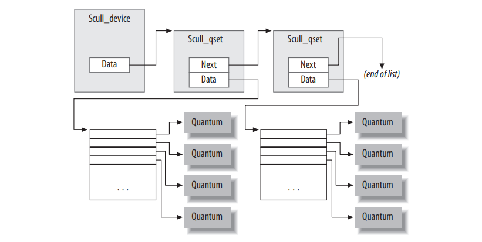
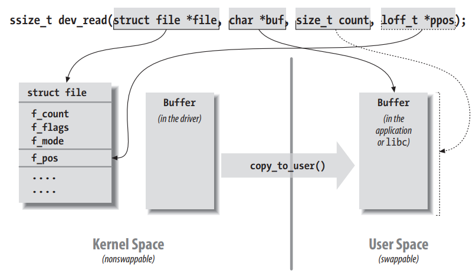

# Char Drivers

Character drivers are suitable for most simple hardware devices. Char drivers are also easier to understand than block drivers or network drivers.

***scull:*** Simple Character Utility for Loading Localities. *scull* is a char driver that acts on a memory area as though it were a device. Scull is not hardware dependent. But the device doesn't do anything useful other than demonstrate the interface between the kernel and char drivers and allow the user to run some tests.

## The Design of scull

The first step of driver writing is defining the capabilities (the mechanism) the driver will offer to user programs. Since our “device” is part of the computer’s memory, we’re free to do what we want with it. It can be a sequential or random-access device, one device or many, and so on. To make scull useful as a template for writing real drivers for real devices, we’ll show you how to implement several device abstractions on top of the computer memory,
each with a different personality.

The scull source implements the following devices. Each kind of device implemented by the module is referred to as a type.

_**scull0 to scull3**_
>Four devices, each consisting of a memory area that is both global and persistent. Global means that if the device is opened multiple times, that data contained within the device is shared by all the file descriptors that opened it. Persistent means that if the device is closed and reopened, data isn’t lost. This device can be fun to work with, because it can be accessed and tested using conventional commands, such as cp, cat, and shell I/O redirection.

_**scullpipe0 to scullpipe3**_
> Four FIFO (first-in-first-out) devices, which act like pipes. One process reads what another process writes. If multiple processes read the same device, they contend for data. The internal of *scullpipe* will show how blocking and non-blocking *read* and *write* can be implemented without having to resort to interrupts.  Although real drivers synchronize with their devices using hardware interrupts, the topic of blocking and nonblocking operations is an important one and is separate from interrupt handling (covered in Chapter 10)

_**scullsingle**_

_**scullpriv**_

_**sculluid**_

_**scullwuid**_
> These devices are similar to *scull0* but with some limitations on when an *open* is permitted. The firs (*scullsingle*) allows only one process at a time to use the driver, whereas *scullpriv* is private to each virtual console (or X terminal session), because processes on each console/terminal get different memory areas. *sculluid* and *scullwuid* can be opened multiple times, but only by one user at a time; the former returns an error of "Device Busy" if another user is locking the device, whereas the latter implements blocking *open*. These variations of *scull* would appear to be confusing polic and mechanism, but they are worth looking at, because some real-life devices require this sort of management.

Each of the *scull* devices demonstrates different features of a driver and presents different difficulties.We will cover the internals of scull0 to scull3; the more advanced devices are covered in Chapter 6. *scullpipe* is described in the section "A Blocking I/O Example," and the others are described in "Access Control on a Device File."

## Major and Minor Numbers

Char devices are accessed through names in filesystem. Those names are called special files or device files or simply **nodes** of the filesystem tree; they're conventionally located in the */dev* directory. **Special files for char drivers are identified bu a "c" in the first column of the output of *ls -l*. Block devices appear in /dev as well, they are identified bu "b".**

Two numbers (seperated by comma) in the device file entries before the date of the last modification, where the file length normally appears. These numbers are **the major and minor device number for the particular device. The major numbers of the following are 1, 4, 7, and 10, while the minors are 1, 3, 5, 64, 65, and 129.**
```
 crw-rw-rw- 1 root root 1, 3 Apr 11 2002 null
 crw------- 1 root root 10, 1 Apr 11 2002 psaux
 crw------- 1 root root 4, 1 Oct 28 03:04 tty1
 crw-rw-rw- 1 root tty 4, 64 Apr 11 2002 ttys0
 crw-rw---- 1 root uucp 4, 65 Apr 11 2002 ttyS1
 crw--w---- 1 vcsa tty 7, 1 Apr 11 2002 vcs1
 crw--w---- 1 vcsa tty 7, 129 Apr 11 2002 vcsa1
 crw-rw-rw- 1 root root 1, 5 Apr 11 2002 zero
```
Traditionally, the major number identifies the driver associated with the device. **For example, */dev/null* and */dev/zero* are both managed by driver 1, whereas virtual consoles and serial terminals are managed by driver 4; similarly, both *vcs1* and *vcsa1* devices are managed by driver 7.** Modern Linux kernels allow multiple drivers to share major numbers, but most devices that you will see are still organized on the one-major-one-driver principle.

**The minor number** is used by the kernel to determine exactly which device is being referred to. Depending on how your driver is written (we will see below), you can either get a direct pointer to your device from the kernel, or you can use the minor number yourself as an index into a local array of devices. Either way, the kernel itself knows almost nothing about minor numbers beyond the fact that they refer to devices implemented by your driver.

## The Internal Representation of Device Numbers
Within the kernel, the dev_t type (defined in *<linux/types.h>* is used to hold device numbers, both the major and minor parts. As of Version 2.6.0 of the kernel, dev_t is a 32-bit quantity with 12 bits set aside for the major number and 20 for the minor number. Your code should, of course, never make any assumptions about internal organization of device numbers; it should, instead, make use of a set of macros found in *<linux/kdev_t.h>*. To obtain the major or minor parts of a dev_t, use:
```
MAJOR(dev_t dev);
MINOR(dev_t dev);
```
If you have the major and minor numbers and need to turn them into a dev_t, use:
```
MKDEV(int major, int minor);
```
Keep in your mind, 2.6 kernel can accomodate a vast number of devices, while previous kernel versions were limited to 255 major and 255 minor numbers.

## Allocating and Freeing Device Numbers 
One of the first things your **driver** will need to do when setting up a char device is to obtain one or more **device numbers** to work with. The necessary function for this task is *register_chrdev_region,* which is declared in _<linux/fs.h>_:
```
int register_chrdev_region(dev_t first, unsigned int count, char *name);
```
Here, first is **the beginning device number of the range you would lile to allocate.** the minor number portion of **first** is often 0, but there's no requirement to that effect. **count** is the total number of contiguous device numbers you're requesting. Note that, if count is large, the range you request could spill over to the next major number; but everything will still work properly as long as the number range you request is available. Finally, **name** is the name of the device that should be associated with this number range; it will appear in */proc/devices* and sysfs.

As with most kernel functions, the return value from _**register_chrdev_region**_ will be 0 if the allocation was successfully performed. In case of error, a negative error code will be returned, and you'll not have access to the requested region. _**register_chrdev_region**_ works well if you know ahead of time exactly which device numbers you want. Often, however, you'll not know which major numbers your device will use; there's a constant effort within the Linux kernel development community to move over to the use of **dynamically-allocated** device numbers. The kernel will happily allocate a **major number** for you on the fly, but you must request this allocation by using a different function:
```
int alloc_chrdev_region(dev_t *dev, unsigned int firstminor, unsigned int count, char *name);
```
With this function, **dev** is an output-only parameter that will, on successful completion, hold the first number in your allocated range. **firstminor** should be the requested first minor number to use; it's usually 0. The **count** and __name__ parameters work like those given to *register_chrdev_region*. Regardless of how you allocate your device numbers, you should free them when they're no longer in use. Device numbers freed with:
```
void unregister_chrdev_region(dev_t first, unsigned int count);
```
The usual place to call _**unregister_chrdev_region**_ would be in your module's cleanup function. the above functions allocate device numbers for your driver's use, but **they don't tell the kernel anything about what you'll actually do with those numbers.** Before a user-space program can access one of those device numbers, **your driver needs to connect them to its internal functions that implement the device's operations.** How this connection is accomplished, will be described shortly, but before that, There're a couple of necessary digressions to take care of first.

## Dynamic Allocation of Major Numbers
Some major device numbers are statically assigned to the most common devices. A list of those devices can be found in *Documentation/devices.txt* within the kernel source tree. So, as a driver writer, you have a choice: you can simply pick a number that appears to be unused, or you can allocate major numbers in a dynamic manner. Thus, for new drivers, we strongly suggest that you use dynamic allocation to obtain your major device number, rather than choosing a number randomly from the ones that are currently free. In other words, your drivers should almost certainly be using ***alloc_chrdev_region*** rather than ***register_chrdev_region.***

The disadvantage of dynamic assignment is that you can't create the device nodes in advance, because the major number assigned to your module will vary. For normal use of the driver, this is hardly a problem, because once the number has been assigned, you can read it from */proc/devices.* To load a driver using a dynamic major number, therefore, the invocation of _insmod_ can be replaced by a simple script that, after calling _insmod_, reads _/proc/devices_ in order to create the special file(s).

A typical _/proc/devices_ file looks like the following:
```
Character devices:
 1 mem
 2 pty
 3 ttyp
 4 ttyS
 6 lp
 7 vcs
 10 misc
 13 input
 14 sound
 21 sg
 180 usb

Block devices:
 2 fd
 8 sd
 11 sr
 65 sd
 66 sd
```
The script to load a module that has been asigned a dynamic number can be written using a tool such as _awk_ to retrieve information from _/proc/devices_ in order to create the files in _/dev_.

The following script, *scull_load*, is part of the _scull_ distribution. The user of a driver that is distributed in the form of a module can invoke such a script from the system's _rc.local_ file or call it manually whenever the module is needed.
```
#!/bin/sh
module="scull"
device="scull"
mode="664"

# invoke insmod with all arguments we got
# and use a pathname, as newer modutils don't look in . by default
/sbin/insmod ./$module.ko $* || exit 1

# remove stale nodes
rm -f /dev/${device}[0-3]

major=$(awk "\$2= =\"$module\" {print \$1}" /proc/devices)

mknod /dev/${device}0 c $major 0
mknod /dev/${device}1 c $major 1
mknod /dev/${device}2 c $major 2
mknod /dev/${device}3 c $major 3

# give appropriate group/permissions, and change the group.
# Not all distributions have staff, some have "wheel" instead.
group="staff"
grep -q '^staff:' /etc/group || group="wheel"

chgrp $group /dev/${device}[0-3]
chmod $mode /dev/${device}[0-3]
```
***mknod***; is the command used to create device files, **which can act strangely compared to normal file**. Device files are kept in _/dev_, and unlike normal files, these are files the kernel knows about, and **read/writes** to. 

Usage of mknod:
```
 mknod device-name device-type major-number minor-number
```
**device-type**; device files can represent 2 types of device, a storage device (***block***) or a device use for other purpose (***character***). Block devices are things like cd-roms, hard-drives, etc. Character devices are things like _/dev/zero_, _/dev/null_, or any other device not used to store info.
You can take a look at [this page](https://wiki.linuxquestions.org/wiki/Mknod#:~:text=mknod%20is%20the%20command%20used%20to%20create%20device,about%2C%20and%20reads%2Fwrites%20to.%20mknod%20follows%20the%20syntax) for detailed information.

Normally, a **device node** requires a different access policy, so in some way or another access rights must be changed. The default in our script is to give access to a group of users, but your needs may vary. In the section “Access Control on a Device File” in Chapter 6, the code for sculluid demonstrates how the driver can enforce its own kind of authorization for device access.

A *scull_unload* script is also available to clean up the /dev directory and remove the module.

Here’s the code we use in scull’s source to get a major number:
```
    if (scull_major) {
        dev = MKDEV(scull_major, scull_minor);
        result = register_chrdev_region(dev, scull_nr_devs, "scull");
    } else {
        result = alloc_chrdev_region(&dev, scull_minor, scull_nr_devs, "scull");
        scull_major = MAJOR(dev);
    }
    if (result < 0) {
        printk(KERN_WARNING "scull: can't get major %d\n", scull_major);
        return result;
    }
```
## File Operations
So far, we have reserved some device numbers for our use, but we haven't yet connected any of our driver's operations to those numbers.The file_operations structure is how a char driver sets up this connection. The structure, defined in _<linux/fs.h>_, is a collection of function pointers. Each open file is associated with its own set of functions (by including a field called f_op that points to a dile_operations structure). The operations are mostly in charge of implementing the system calls and named _open, read_ and so on. We can consider the file to be an "object" and the functions operating on it to be its "methods", uding object-oriented programming terminology to denote actions declared by an object to act on itself.  This is the first sign of object-oriented programming we see in the Linux kernel.

Conventionally, a file_operations structure or a pointer to one is called fops (or some variation thereof). Each field in the structure must point to the function in the driver that implements a specific operation, or be left NULL for unsupported operations. The exact behavior of the kernel when a NULL pointer is specified is different for each function, as the list later in this section shows. 

The following is from [this address](https://www.linuxtopia.org/online_books/Linux_Kernel_Module_Programming_Guide/x573.html#:~:text=The%20file_operations%20structure%20is%20defined%20in%20linux%2Ffs.h%2C%20and,by%20the%20driver%20to%20handle%20a%20requested%20operation.):

The file_operations structure is defined in **<linux/fs.h>**, and holds pointers to functions defined by the driver that perform various operations on the device. Each field of the structure corresponds to the address of some function defined by the driver to handle a requested operation.
For example, every character driver needs to define a function that reads from the device. The file_operations structure holds the address of the module's function that performs that operation. Here is what the definition looks like for kernel 2.6.5:
```
struct file_operations {
	struct module *owner;
	 loff_t(*llseek) (struct file *, loff_t, int);
	 ssize_t(*read) (struct file *, char __user *, size_t, loff_t *);
	 ssize_t(*aio_read) (struct kiocb *, char __user *, size_t, loff_t);
	 ssize_t(*write) (struct file *, const char __user *, size_t, loff_t *);
	 ssize_t(*aio_write) (struct kiocb *, const char __user *, size_t, loff_t);
	int (*readdir) (struct file *, void *, filldir_t);
	unsigned int (*poll) (struct file *, struct poll_table_struct *);
	int (*ioctl) (struct inode *, struct file *, unsigned int, unsigned long);
	int (*mmap) (struct file *, struct vm_area_struct *);
	int (*open) (struct inode *, struct file *);
	int (*flush) (struct file *);
	int (*release) (struct inode *, struct file *);
	int (*fsync) (struct file *, struct dentry *, int datasync);
	int (*aio_fsync) (struct kiocb *, int datasync);
	int (*fasync) (int, struct file *, int);
	int (*lock) (struct file *, int, struct file_lock *);
	 ssize_t(*readv) (struct file *, const struct iovec *, unsigned long, loff_t *);
	 ssize_t(*writev) (struct file *, const struct iovec *, unsigned long, loff_t *);
	 ssize_t(*sendfile) (struct file *, loff_t *, size_t, read_actor_t, void __user *);
	 ssize_t(*sendpage) (struct file *, struct page *, int, size_t, loff_t *, int);
	unsigned long (*get_unmapped_area) (struct file *, unsigned long, unsigned long, unsigned long, unsigned long);
};
```
Some operations are not implemented by a driver. For example, a driver that handles a video card won't need to read from a directory structure. The corresponding entries in the file_operations structure should be set to NULL. There's a gcc extension that makes assigning to this structure more convenient. You'll see it in modern drivers, and may catch you by surprise. This is what the new way of assigning to the structure looks like:
```
struct file_operations fops = {
	read: device_read,
	write: device_write,
	open: device_open,
	release: device_release
};
```
However, there's also a C99 way of assigning to elements of a structure, and this is definitely preferred over using the GNU extension. The version of gcc I'm currently using, 2.95, supports the new C99 syntax. You should use this syntax in case someone wants to port your driver. It will help with compatibility:
```
struct file_operations fops = {
	.read = device_read,
	.write = device_write,
	.open = device_open,
	.release = device_release
};
```
A pointer to a struct file_operations is commonly named fops.
>__struct module *owner__
>>The first file_operations field is not an operation at all; it's a pointer to the module that "owns" the structure. This field is used to prevent the module from being unloaded while its operations are in user. Almost all the time, it's simply initialized to THIS_MODULE, a macro defined in _<linux/module.h>_.

>__loff_t (*llseek) (struct file *, loff_t, int);__
>>The *llseek* method is used to change the current read/write position in a file, and the new position is returned as a (positive) return value. The loff_t parameter is a “long offset” and is at least 64 bits wide even on 32-bit platforms. Errors are signaled by a negative return value. If this function pointer is NULL, seek calls will modify the position counter in the file structure (described in the section “The file Structure”) in potentially unpredictable ways.

>**ssize_t (*read) (struct file *, char __user *, size_t, loff_t *)**;
>>Used to **retrieve data from the device**. A null pointer in this position causes the _read_ system call to dail with -EINVAL ("Invalid argument"). A nonnegative return value represents the number of bytes successfully read (the return value is a "signed size" type, usually the native integer type for the target platform).

>__ssize_t (*aio_read)(struct kiocb *, char __user *, size_t, loff_t)__;
>>Initiate an asynchronous read, a read operation that might not complete before the function returns. If this method is NULL, all operations will be processed (synchronously) by _read_ instead.

>**ssize_t (*write) (struct file *, const char __user *, size_t, loff_t *)**;
>>Sends data to the device. If NULL, -EINVAL is returned to the program calling the _write_ system call. The return value, if nonnegative, represents the number of bytes successfully written.

>**ssize_t (*aio_write)(struct kiocb *, const char __user *, size_t, loff_t *)**;
>>Initiates an asynchronous write operation on the device.

> **int (*readdir) (struct file *, void *, filldir_t)***;
>>This field should be NULL for device files; it's used for reading directories and is useful only for filesystems.

> __unsigned int (*poll) (struct file *, struct poll_table_struct *)__;
>>The _poll_ method is the back end of three system calls: _poll, epoll,_ and _select,_ all of which are used to query whether a read or write to one or more file descriptors would block. The _poll_ method should return a bit mask indicating whether non-blocking reads or writes are possible, and, possibly, provide the kernel with information that can be used to put the calling process to sleep until I/O becomes possible. If a driver leaves its _poll_ method NULL, the device is assumed to be both readable and writable without blocking.

> __int (*ioctl) (struct inode *, struct file *, unsigned int, unsigned long)__;
>>**IMPORTANT** | The _ioctl_ system call offers a way to issue device-specific commands (such as formatting a track of a floppy disk, which is neither reading nor writing). Additionally, a few ioctl commands are recognized by the kernel without referring to the fops table. If the device doesn't provide an _ioctl_ method, the system call returns an error for any request that isn't predefined (-ENOTTY, "No such ioctl for device").

>__int (*mmap) (struct file *, struct vm_area_struct *)__;
>>_mmap_ is used to request a mapping of device memory to a process's address space. If this method is NULL, the _mmap_ system call returns -ENODEV.

>__int (*open) (struct inode *, struct file *)__;
>>Though this is always the first operation performed on the device file, the driver is not required to declare a corresponding method. If this entry is NULL, opening the device always succeeds, but your driver isn't notified.

>__int (*flush) (struct file *)__;
>>The _flush_ operation is invoked when a process closes its copy of a file descriptor for a device; it should execute (and wait for) any outstanding operations on the device. This must not be confused with the _fsync_ operation requested by user programs. Currently, _flush_ is used in very few drivers; the SCSI tape driver uses it, for example, to ensure that all data written makes it to the tape before the device is closed. If _flush_ is NULL, the kernel simply ignores the user application request.

> __int (*release) (struct inode *, struct file *)__;
>> This operation is invoked when the file structure is being released. Like _open_, _release_ can be NULL.

> __int (*fsync) (struct file *, struct dentry *, int)__;
>> This method is the back end of the _fsync_ system call, which a user calls to flush any pending data. If this pointer is NULL, the system call returns -EINVAL.

> **int (*aio_fsync)(struct kiocb *, int)**;
>>This is the asynchronous version of the _fsync_ method.

> **int (*fasync) (int, struct file *, int)**;
>>This operation is used to notify the device of a change in its FASYNC flag. Asynchronous notification is an advanced topic and is described in Chapter 6. The field can be NULL if the driver doesn't support asynchronous notification.

> **int (*lock) (struct file *, int, struct file_lock *)***;
>>The _lock_ method is used to implement file locking; locking is an indispensable feature for regular files but is almost never implemented by device drivers.

> **ssize_t (*readv) (struct file *, const struct iovec *, unsigned long, loff_t *)**;

> **ssize_t (*writev) (struct file *, const struct iovec *, unsigned long, loff_t *)**;
>> These methods implement scatter/gather read and write operations. Applications occasionally need to do a single read or write operation involving multiple memory areas; these system calls allow them to do so without forcing extra copy operations on the data. If these function pointers are left NULL, the _read_ and _write_ methods are called (perhaps more than once) intead.

> **ssize_t (*sendfile)(struct file *, loff_t *, size_t, read_actor_t, void *)**;
>> This method implements the read side of the _sendfile_ system call, which moves the data from one file descriptor to another with a minimum of copying. It's used, for example, by a web server that needs to send the contents of a file out a network connection. Device drivers usually leave _sendfile_ NULL.

> **ssize_t (*sendpage) (struct file *, struct page *, int, size_t, loff_t *, int)**;
>> _sendpage_ is the other half of _sendfile_; it's called by the kernel to send data, one page at a time, to the corresponding file. Device drivers do not usually implement _sendpage_.

> **unsigned long (*get_unmapped_area)(struct file *, unsigned long, unsigned long, unsigned long, unsigned long)**;
>> The purpose of this method is to find a suitable location in the process's address space to map in a memory segment on the underlying device. This task is normally performed by the memory management code; this method exists to allow drivers to enforce any alignment requirements a particular device may have. Most drivers can leave this method NULL.

> **int (*check_flags)(int)***
>> This method allows a module to check the flags passed to an *fcntl(F_SETFL...)* call.

> **int (*dir_notify)(struct file *, unsigned long)**;
>> This method is invoked when an application uses _fcntl_ to request directory change notifications. It's useful only to filesystems; drivers need not implement *dir_notify*.

The scull device driver implements only the most important device methods. Its file_operations structure is initialized as follows:
```
struct file_operations scull_fops = {
 .owner = THIS_MODULE,
 .llseek = scull_llseek,
 .read = scull_read,
 .write = scull_write,
 .ioctl = scull_ioctl,
 .open = scull_open,
 .release = scull_release,
};
```
This declaration uses the standard C tagged structure initialization syntax. This syntax is preffered because it makes drivers more portable acrross changes in the definitions of the structures and, arguably, makes the code more compact and readable. Tagged initialization allows the reordering of structure members; in some cases, substantial performance improvements have been realized by placing pointers to frequently accessed members in the same hardware cache line.

## The file structure 
Each device is represented in the kernel by a file structure, which is defined in _**<linux/fs.h>**_. Be aware that a file is a kernel level structure and **never appears in a user space program**. It's not the same thing as a FILE, which is defined by glibc and would never appear in a kernel space function. Also, its name is a bit misleading; it represents an abstract 'file', not a file on a disk, which is represented by a structure named **inode**.

In the kernel sources, a pointer to struct file is usually called either _file_ or _filp_ ("file pointer"). The most important fields of struct file are shown here:
> **mode_t f_mode;**
>>The file mode identifies the file as either readable or writable (or both), by means of the bits FMODE_READ and FMODE_WRITE.

> **loff_t f_pos;**
>> The current reading or writing position. loff_t is a 64-bit value on all platforms (long long in gcc terminology). **filp->f_pos**

> **unsigned int f_flags;**
>> These are the file flags, such as **O_RDONLY, O_NONBLOCK,** and **O_SYNC**. All the flags are defined in the header **<linux/fcntl.h>**.

> __struct file_operations *f_op;__
>> **filp->f_op** depends on the minor number being opened.

> **void *private_data;***
>> The ***open*** system call sets this pointer to NULL before calling the _open_ method for the driver. You are free to make its own use of the field or to ignore it; you can use the field to point to allocated data, but then you must remember to free that memory in the release method before the file structure is destroyed by the kernel. private_data is a useful resource for preserving state information across system calls and is used by most of our sample modules.

> **struct dentry *f_dentry;***
>> The directory entry (_dentry_) structure associated with the file. **filp->f_dentry->d_inode**

## The inode Structure

The _inode_ structure is used by the kernel internally to represent files. It's different from the file structure that represents an open file descriptor. There can be numerous file structures representing multiple open descriptors on a single file, but they all point to a single inode structure. The inode structure contains a freat deal of information about the file. As a general rule, only two fields of this structure are of interest for writing driver code:
> **dev_t i_rdev;**
>>For inodes that represent device files, this field contains the actual device number.

> **struct cdev *i_cdev;***
>>struct cdev is the kernel's internal structure that represents char devices; this field contains a pointer to that structure when the inode refers to a char device file.

As a way of encouraging more portable programming, the kernel developers have added two macros that can be used to obtain the major and minor number from an inode:
```
unsigned int iminor(struct inode *inode);
unsigned int imajor(struct inode *inode);
```
## Char Device Registration

As we mentioned, the kernel uses structures of type struct cdev to represent char devices internally. Before the kernel invokes your device's operations, you must allocate and register one or more of these structures. Your code should include ***<linux/cdev.h>***, where the structure and its associated helper functions are defined. 

There are two ways of allocating and initializing one of these structures. If you wish to obtain a standalone cdev structure at runtime, you may do so with code such as:
```
struct cdev *my_cdev = cdev_alloc();
my_cdev->ops = &my_fops;
```
You will want to embed the cdev structure within a device-specific structure of your own. In that case, you should initialize the structure that you have already allocated with:
```
void cdev_init(struct cdev *cdev, struct file_operations *fops);
```
Once the cdev structure is set up, the final step is to tell the kernel about it with a call to:
```
int cdev_add(struct cdev *dev, dev_t num, unsigned int count);
```
Here, **dev** is the _cdev_ structure, **num** is the first device number to which this device responds, and **count** is the number of device numbers that should be associated with the device. Often count is one, but there are situations where it makes sense to have more than one device number correspond to a specific device. There are a couple of important things to keep in mind when using cdev_add. The first is that this call can fail. If it returns a negative error code, your device has not been added to the system. It almost always succeeds, however, and that brings up the other point: as soon as cdev_add returns, your device is “live” and its operations can be called by the kernel. You should not call cdev_add until your driver is completely ready to handle operations on the device

To remove a char device from the system, call:
```
void cdev_del(struct cdev *dev);
```
Clearly, you should not access the cdev structure after passing it to *cdev_del*.

## Device Registration in scull

Internally, *scull* represents each device with a structure of type *struct scull_dev*:
```
struct scull_dev {
 struct scull_qset *data; /* Pointer to first quantum set */
 int quantum; /* the current quantum size */
 int qset; /* the current array size */
 unsigned long size; /* amount of data stored here */
 unsigned int access_key; /* used by sculluid and scullpriv */
 struct semaphore sem; /* mutual exclusion semaphore */
 struct cdev cdev; /* Char device structure */
};
```
We call attention to cdev, the struct cdev that interfaces our device to the kernel. This structure must be initialized and added to the system as described above; the _scull_ code that handles this task is:
```
static void scull_setup_cdev(struct scull_dev *dev, int index)
{
 int err, devno = MKDEV(scull_major, scull_minor + index);
 cdev_init(&dev->cdev, &scull_fops);
 dev->cdev.owner = THIS_MODULE;
 dev->cdev.ops = &scull_fops;
 err = cdev_add (&dev->cdev, devno, 1);
 /* Fail gracefully if need be */
 if (err)
 printk(KERN_NOTICE "Error %d adding scull%d", err, index);
}
```
Since the cdev structure is embedded within struct scull_dev, cdev_init must be called to perform the initialization of that structure.
## The Older Way

The classic way to register a char device driver is with:
```
int register_chrdev(unsigned int major, const char *name, struct file_operations *fops);
```
Here, **major** is the major number of interest, **name** is the name of the driver (it appears in _/proc/devices_), and **fops** is the default file_operations structure. A call to *register_chrdev* registers minor numbers 0–255 for the given major, and sets up a default cdev structure for each. Drivers using this interface must be prepared to handle open calls on all 256 minor numbers (whether they correspond to real devices or not), and they cannot use major or minor numbers greater than 255.

If you use *register_chrdev*, the proper function to remove your device(s) from the system is:
```
int unregister_chrdev(unsigned int major, const char *name);
```
**major** and **name**, of course, must be the same as those passed to *register_chrdev*, otherwise the call will fail.

## open and release
Now that we've taken a quick look at the fields, we start using them in real _scull_ functions.

## The open Method

The *open* method is provided for a driver to do any initialization in preperation for later operations. In most drivers, _open_ should perform the following tasks:
* Check for device-specific errors (such as device-not-ready or similar hardware problems)
* Initialize the device if it's being opened for the first time
* Update **f_op** pointer, if necessary
* Allocate and fill any data structure to be put in **filp->private_data**

First to do is usually identifying which device is being opened. Remember he prototype for the _open_ method is:
```
int (*open)(struct inode *inode, struct file *filep);
```
The _inode_ argument has the information we need in the form of its **i_cdev** field, which contains the cdev structure we set up before. The only problem is that we don't normally want the cdev structure itself, we want the scull_dev structure that contains that cdev structure. Fortunately, in this case, the kernel hackers have done the tricky stuff for us, in the form of the *container_of* macro, defined in *<linux/kernel.h>*:
```
container_of(pointer, container_type, container_field);
```
This macro returs a pointer to the containing structure. In *scull_open*, this macro is used to find the appropriate device structure:
```
struct scrull_dev *dev; /* device information */

dev = container_of(inode->i_cdev, struct scull_dev, cdev);
filp->private_data = dev; /* for the other methods */
```
Once it has found the scull_dev structure, _scull_ stores a pointer to it in the private_data field of the file structure for easier access in the future.

The other way to identify the device being opened is to look at the minor number stored in the inode structure. **If you register your device *register_chrdev*, you must use this technique.** Be sure to use _iminor_ to obtain the minor number from the inode structure, and make sure that it corresponds to a device that your driver is actually prepared to handle. The (slightly simplified) code for *scull_open* is:
```
int scull_open(struct inode *inode, struct file *filp)
{
 struct scull_dev *dev; /* device information */
 dev = container_of(inode->i_cdev, struct scull_dev, cdev);
 filp->private_data = dev; /* for other methods */
 /* now trim to 0 the length of the device if open was write-only */
 if ( (filp->f_flags & O_ACCMODE) = = O_WRONLY) {
 scull_trim(dev); /* ignore errors */
 }
 return 0; /* success */
}
```
## The release Method
It's just the reverse of open. Sometimes it may be called *device_close* instead of *device_release*. Either way, the device method shold perform the following tasks:
* Deallocate anything that _open_ allocated in **filp->private_data**
* Shut down the device on last close

The basic form of scull has no hardware to shut down, so the code required is minimal:
```
int scull_release(struct inode *inode, struct file *filp)
{
    return 0;
}
```
So, what happens when a device is closed more times than it is opened? After all, the ***dup*** and ***fork*** system calls create copies of open files without calling open; each of those copies is then closed at program termination. How does a driver know when an open device file has really been closed? The answer is simple: not every *close* system call causes the *release* method to be invoked. Only the calls that actually release the device data structure invoke the method, hence its name. The kernel keeps a counter of how many times a file structure is being used.

Note that the ***flush*** method is called every time an application calls _close_.

## scull's Memory Usage

This section deals only with the memory allocation policy in scull and doesn’t show
the hardware management skills you need to write real drivers. These skills are introduced in Chapters 9 and 10. Therefore, you can skip this section if you’re not interested in understanding the inner workings of the memory-oriented scull driver. The region of memory used by _scull_, also called a _device_, is variable in length. The more you write, the more it grows; trimming is performed by overwriting the device with a shorter file.

The scull driver introduces two core functions use dto manage memeory in the Linux kernel. These functions, defined in *<linux/slab.h>*, are:
```
void *kmalloc(size_t size, int flags);
void kfree(void *ptr);
```
You can use the command _cp /dev/zero /dev/scull_ to eat all the real RAM with _scull_, and you can use the _dd_ utility to choose how much data is copied to the _scull_ device. In _scull_, each device is a linked list of pointers, each of which points to a **scull_qset** structure. Each such structure can refer, by default, to at most four million bytes, through an array of intermediate pointers. We call each memory area a _quantum_ and the array a _quantum_ set.



```
struct scull_qset {
 void **data;
 struct scull_qset *next;
};
```
The next code fragment shows in practice how struct scull_dev and struct scull_qset are used to hold data. The function *scull_trim* is in charge of freeing the whole data area and is invoked by *scull_open* when the file is opened for writing. It simply walks through the list and frees any quantum and quantum set it finds.

**A flashback to scull_dev structure**:
```
struct scull_dev {
 struct scull_qset *data; /* Pointer to first quantum set */
 int quantum; /* the current quantum size */
 int qset; /* the current array size */
 unsigned long size; /* amount of data stored here */
 unsigned int access_key; /* used by sculluid and scullpriv */
 struct semaphore sem; /* mutual exclusion semaphore */
 struct cdev cdev; /* Char device structure */
};
```
***
```
int scull_trim(struct scull_dev *dev)
{
    struct scull_qset *next, *dptr;
    int qset = dev->qset;   /* "dev" is not-null */
    int i;
    
    for (dptr = dev->data; dptr; dptr = next) { /* all thelist items */
        if (dptr->data) {
            for (i = 0; i < qset; i++)
                kfree(dptr->data);
            kfree(dptr->data);
            dptr->data = NULL;
        }
        next = dptr->next;
        kfree(dptr);
    }
    dev->size = 0;
    dev->quantum = scull_quantum;
    dev->qset = scull_qset;
    dev->data = NULL;
    return 0;
}
```
*scull_trim* is also used in the module cleanup function to return memory used by _scull_ to the system.

## read and write
The _read_ and _write_ methods both perform a similar task, that is, copying data from and to application code. Therefore, their prototypes are pretty similar, and it's worth introducing them at the same time:
```
ssize_t read(struct file *filp, char __user *buff, size_t count, loff_t *offp);
ssize_t write(struct file *filp, const char __user *buff, size_t count, loff_t *offp);
```
For both methods, **filp** is the file pointer and **count** is the size of the requested data transfer. The **buff** argument points to the user buffer holding the data to be written or the empty buffer where the newly read data should be placed. Finally, **offp** is a pointer to a "long offset type" object that indicates the file position the user is accessing. The return value is a "signed size type"; its use is discussed later. Your driver must be able to access the user-space buffer in order to get its job done. This access must always be performed by special, kenrel-supplied functions, however, in order to be safe, which are defined in _<asm/uaccess.h>_.

The code for _read_ and _write_ in _scull_ needs to copy a whole segment of data to or from the user address space. This capability is offered by the following kernel functions, which copy an arbitrary array of bytes and sit at the heart of most _read_ and _write_ implementations:
```
unsigned long copy_to_user(void __user *to, const void *from, unsigned long count);
unsigned long copy_from_user(void *to, const void __user *from, unsigned long count);
```
Although these functions behave like normal ***memcpy*** functions, a little extra care must be used when accessing user space from kernel code. The role of the two functions is not limited to copying data to and from user-space: they also check whether the user space pointer is valid. If the pointer is invalid, no copy is performed; if an invalid address is encountered during the copy, on the other hand, only part of the data is copied. In both cases, the return value is the amount of memory still to be copied. The scull code looks for this error return, and returns -EFAULT to the user if it’s not 0.

Whatever the amount of data the methods transfer, they should generally update the file position at __*offp__ to represent the current file position after succesful completion of the system call. The kernel then propagates the file position change back into the file structure when appropriate. The _pread_ and _pwrite_ system calls have different semantics, however; they operate from a given file offset and do not change the file position as seen by any other system calls. These calls pass in a pointer to the user-supplied position, and discard the changes that your driver makes.

Representation how a typical _read_ implementation uses its arguments:



Both the _read_ and _write_ methods return a negative value if an error occurs. A return value greater than or equal to 0, instead, tells the calling program how many bytes have been succesfully transferred. The user-space behavior is dictated by the POSIX standard, but that standard does not make requirements on how the kernel operates internally.

## The read Method
The return value for _read_ is interpreted by the calling application program:
* If the value equals the count argument passed to the_read_ system call, the requested number of bytes has been transfered. This is the optimal case.
* If the value is positive, but smaller than count, only part of the data has been transfered. This may happen for a number of reasons, depending on the device. Most often, the application program retries the read. For instance, if you read using the _fread_ function, the library funtion reissues the system call until completion of the requested data transfer.
* If the value is 0, end-of-file was reached (and no data was read).
* A negative value means there was an error. The value specifies what the error was, according to _<linux/errno.h>_. Typical values returned on error include -EINTR (interrupted system call) or -EFAULT (bad address).

Here is the code for _read:_
```
ssize_t scull_read(struct file *filp, char __user *buf, size_t count, loff_t *f_pos)
{
    struct scull_dev *dev = filp->private_data;
    struct scull_qset *dptr;    /* the first listitem */
    int quantum, qset;
    int itemsize; /* how many bytes in the listitem */
    int item, s_pos, q_pos, rest;
    ssize_t retval = 0;
 
    if (down_interruptible(&dev->sem))
        return -ERESTARTSYS;
    quantum = dev->quantum;
    qset = dev->qset;
    itemsize = quantum*qset;
 
    if (*f_pos >= dev->size)
        goto out;
    if (*f_pos + count > dev->size)
        count = dev->size - *f_pos;
 
    /* find listitem, qset index, and offset in the quantum */
    item = (long)*f_pos / itemsize;
    rest = (long)*f_pos % itemsize;
    s_pos = rest / quantum; q_pos = rest % quantum;
 
    /* follow the list up to the right position (defined elsewhere) */
    dptr = scull_follow(dev, item);
    
    if (dptr = = NULL || !dptr->data || ! dptr->data[s_pos])
        goto out; /* don't fill holes */
    
    /* read only up to the end of this quantum */
    if (count > quantum - q_pos)
        count = quantum - q_pos;
 
    if (copy_to_user(buf, dptr->data[s_pos] + q_pos, count)) {
        retval = -EFAULT;
        goto out;
    }
    *f_pos += count;
    retval = count;
 
 out:
    up(&dev->sem);
    return retval;
}
```
## The write Method
_write_, like _read_, can transfer less data than was requested, according to the following rules for the return value:
* If the value equals count, the requested number of bytes has been transferred.
*  If the value is positive, but smaller than count, only part of the data has been transferred. The program will most likely retry writing the rest of the data.
* If the value is 0, nothing was written. This result is not an error, and there is no reason to return an error code. Once again, the standard library retries the call to write. We’ll examine the exact meaning of this case in Chapter 6, where blocking write is introduced.
* A negative value means an error occured; as for _read_, valid error values are those defined in _<linux/errno.h>_.

```
ssize_t scull_write(struct file *filp, const char __user *buf, size_t count,
 loff_t *f_pos)
{
    struct scull_dev *dev = filp->private_data;
    struct scull_qset *dptr;
    int quantum = dev->quantum, qset = dev->qset;
    int itemsize = quantum * qset;
    int item, s_pos, q_pos, rest;
    ssize_t retval = -ENOMEM; /* value used in "goto out" statements */
 
    if (down_interruptible(&dev->sem))
        return -ERESTARTSYS;
 
    /* find listitem, qset index and offset in the quantum */
    item = (long)*f_pos / itemsize;
    rest = (long)*f_pos % itemsize;
    s_pos = rest / quantum; q_pos = rest % quantum;
 
    /* follow the list up to the right position */
    dptr = scull_follow(dev, item);
    if (dptr = = NULL)
        goto out;
    if (!dptr->data) {
        dptr->data = kmalloc(qset * sizeof(char *), GFP_KERNEL);
        if (!dptr->data)
            goto out;
        memset(dptr->data, 0, qset * sizeof(char *));
    }
    if (!dptr->data[s_pos]) {
        dptr->data[s_pos] = kmalloc(quantum, GFP_KERNEL);
        if (!dptr->data[s_pos])
            goto out;
    }
    /* write only up to the end of this quantum */
    if (count > quantum - q_pos)
        count = quantum - q_pos;
 
    if (copy_from_user(dptr->data[s_pos]+q_pos, buf, count)) {
        retval = -EFAULT;
        goto out;
    }
    *f_pos += count;
    retval = count;
 
    /* update the size */
    if (dev->size < *f_pos)
        dev->size = *f_pos;
 
 out:
    up(&dev->sem);
    return retval;
}
```
## readv and writev

Unix systems have long supported two system calls named _readv_ and _writev_. These "vector" versions of _read_ and _write_take an array of structures, each of which contains a pointer to a buffer and a length value. If your driver does not supply methods to handle the vector operations, readv and
writev are implemented with multiple calls to your read and write methods. In many situations, however, greater efficiency is acheived by implementing readv and writev directly.

The prototype for the vector operations are:
```
ssize_t (*readv) (struct file *filp, const struct iovec *iov, unsigned long count, loff_t *ppos);
ssize_t (*writev) (struct file *filp, const struct iovec *iov, unsigned long count, loff_t *ppos);
```
Here, the _filp_ and ppos arguments are the same as for _read_ and _write_. Th iovec structure, defined in _<linux/uio.h>_, looks like:
```
struct iovec
{
    void __user *iov_base;
    __kernel_size_t iov_len;
};
```
Each iovec describes one chunk of data to be transferred; it starts at iov_base (in user space) and is iov_len bytes long. The count parameter tells the method how many iovec structures there are. These structures are created by the application, but the kernel copies them into kernel space before calling the driver. The simplest implementation of the vectored operations would be a straightforward loop that just passes the address and length out of each iovec to the driver’s read or write function. Often, however, efficient and correct behavior requires that the driver do something smarter. For example, a writev on a tape drive should write the contents of all the iovec structures as a single record on the tape.

**You can try using cp, dd, and input/output redirection to test out the driver.** Tracing a _cp_ or an _ls -l > /dev/.._ shows quantized reads and writes.

## Quick Reference

```
#include <linux/types.h>
dev_t
    dev_t is the type used to represent device numbers within the kernel.
int MAJOR(dev_t dev);
int MINOR(dev_t dev);
    Macros that extract the major and minor numbers from a device number.
dev_t MKDEV(unsigned int major, unsigned int minor);
    Macro that builds a dev_t data item from the major and minor numbers.
#include <linux/fs.h>
    The “filesystem” header is the header required for writing device drivers. Many
    important functions and data structures are declared in here.
int register_chrdev_region(dev_t first, unsigned int count, char *name)
int alloc_chrdev_region(dev_t *dev, unsigned int firstminor, unsigned int count, char *name)
void unregister_chrdev_region(dev_t first, unsigned int count);
    Functions that allow a driver to allocate and free ranges of device numbers.
    register_chrdev_region should be used when the desired major number is known
    in advance; for dynamic allocation, use alloc_chrdev_region instead.
int register_chrdev(unsigned int major, const char *name, struct file_operations *fops);
    The old (pre-2.6) char device registration routine. It is emulated in the 2.6 kernel but should not be used for new code. 
    If the major number is not 0, it is used unchanged; otherwise a dynamic number is assigned for this device.
int unregister_chrdev(unsigned int major, const char *name);
    Function that undoes a registration made with register_chrdev. Both major and
    the name string must contain the same values that were used to register the driver.
struct file_operations;
struct file;
struct inode;
    Three important data structures used by most device drivers. The file_operations structure holds a char driver’s methods; 
    struct file represents an open file, and struct inode represents a file on disk.
#include <linux/cdev.h>
struct cdev *cdev_alloc(void);
void cdev_init(struct cdev *dev, struct file_operations *fops);
int cdev_add(struct cdev *dev, dev_t num, unsigned int count);
void cdev_del(struct cdev *dev);
    Functions for the management of cdev structures, which represent char devices within the kernel.
#include <linux/kernel.h>
container_of(pointer, type, field);
    A convenience macro that may be used to obtain a pointer to a structure from a
    pointer to some other structure contained within it.
#include <asm/uaccess.h>
    This include file declares functions used by kernel code to move data to and
    from user space.
unsigned long copy_from_user (void *to, const void *from, unsigned long count);
unsigned long copy_to_user (void *to, const void *from, unsigned long count);
    Copy data between user space and kernel space.
```


